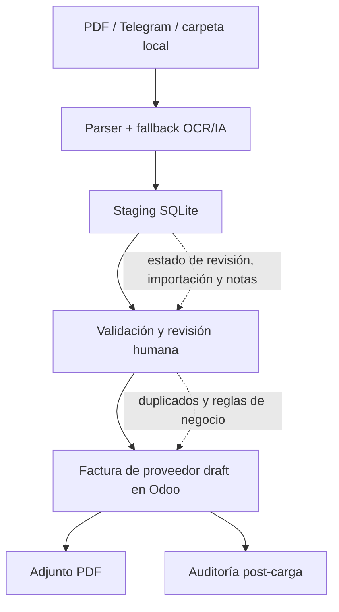

English version: [README.md](README.md)

# AI-Assisted Invoice Processing for Procurement Operations

Case type: Procurement automation / Invoice intake / AI-assisted ERP workflow

## Executive Summary

La recepción de facturas de proveedores es un punto de fricción dentro de operaciones y cuentas a pagar: los documentos llegan por distintos canales, los campos clave deben interpretarse correctamente y la carga en el ERP necesita ser precisa, trazable y controlada.

Diseñé un MVP para transformar facturas PDF no estructuradas en un workflow revisable: ingesta de facturas, parsing asistido por OCR/IA, staging en SQLite, validaciones, revisión humana y creación controlada de facturas de proveedor en Odoo en estado draft.

El objetivo no era automatizar a ciegas. El objetivo era reducir el riesgo de recarga manual, preservar trazabilidad y crear una base más segura para automatización procure-to-pay, manteniendo la aprobación final en manos humanas.

## Why This Matters

Las facturas de proveedores están en un punto crítico del proceso procure-to-pay. Un error en proveedor, número de documento, tratamiento impositivo, moneda o importe puede generar duplicados, demoras, problemas de conciliación o reprocesos entre compras y cuentas a pagar.

Al mismo tiempo, automatizar la ingesta de facturas sin controles puede ser riesgoso. Una solución útil necesita más que OCR: necesita staging antes de escribir en el ERP, controles de duplicados, auditabilidad y puntos claros de revisión humana.

Este caso muestra la IA como parte de un sistema operativo de control, no como un atajo para saltarse la validación del negocio.

## Business Problem

El proceso partía de un dolor operativo frecuente: las facturas de proveedores llegaban como PDFs y necesitaban interpretarse antes de cargarse en Odoo.

Los principales riesgos eran:

- recarga manual de datos de factura;
- interpretación inconsistente de números de documento, fechas, impuestos, monedas y proveedores;
- facturas de proveedor duplicadas;
- baja trazabilidad entre el PDF original y el registro en el ERP;
- soluciones puntuales por formato de factura, en vez de un proceso repetible.

El objetivo era crear un flujo de ingesta controlado que pudiera preparar borradores en el ERP para revisión, sin reemplazar a la persona responsable de aprobarlos.

## Context

El entorno involucraba compras, cuentas a pagar, facturas de proveedores y Odoo como sistema ERP.

Las facturas podían ingresar desde una carpeta local o desde Telegram. El MVP fue pensado para complementar un flujo existente de importación estructurada de facturas y sumar un canal más flexible para documentos PDF.

Todo el contenido público de este caso está anonimizado. Proveedores reales, identificadores fiscales, importes, documentos, credenciales, bases de datos, rutas locales y capturas internas permanecen privados.

## My Role

Traducí un workflow administrativo desordenado en un diseño de automatización controlada.

Mi rol incluyó:

- definir el flujo desde la ingesta hasta el ERP;
- separar parsing, staging, validación y escritura en ERP;
- diseñar controles para duplicados, estados de revisión, adjuntos y trazabilidad;
- usar OCR/IA como capa de apoyo, no como fuente final de verdad;
- mantener los registros en Odoo en estado draft para revisión humana antes de su contabilización;
- documentar el workflow para poder revisarlo, mejorarlo y extenderlo.

## Approach

Abordé el caso primero como un problema de proceso y control de riesgo, y después como un problema de automatización.

Los principios de diseño fueron:

1. Capturar facturas desde canales prácticos de entrada.
2. Extraer y normalizar solo los campos necesarios para preparar un draft seguro.
3. Guardar los datos parseados en staging antes de tocar el ERP.
4. Marcar documentos inciertos para revisión en vez de forzar la automatización.
5. Controlar duplicados antes de crear registros en el ERP.
6. Crear facturas de proveedor en Odoo solo como drafts.
7. Adjuntar el PDF original y preservar contexto técnico para auditabilidad.

## Before / After

| Before | After |
|---|---|
| Interpretación manual de facturas | Pipeline estructurado de ingesta de facturas |
| PDFs y notas gestionados en distintos canales | Staging centralizado con estado de revisión |
| Carga en ERP dependiente de tipeo manual | Draft de factura de proveedor preparado para revisión |
| Mayor riesgo de duplicados | Controles de duplicados antes de escribir en ERP |
| Vínculo débil entre documento fuente y registro ERP | PDF original adjunto al draft en Odoo |
| OCR/IA tratado como caja negra | OCR/IA como fallback dentro de un workflow controlado |
| Errores detectados tarde | Auditoría post-carga y estados visibles de advertencia |

## Solution

El MVP crea un pipeline controlado para la ingesta de facturas:

- Los PDFs se ingieren desde una carpeta local o desde Telegram.
- Python extrae texto y campos clave de la factura.
- OCR y un fallback opcional de visión con IA ayudan con documentos difíciles.
- Los documentos parseados se guardan en staging SQLite con estado de revisión e importación.
- Las notas humanas pueden aclarar proveedor, orden de compra, logística o imputaciones manuales.
- El importador lee documentos staged y crea facturas de proveedor draft en Odoo vía XML-RPC.
- El PDF original se adjunta al draft de Odoo.
- Los controles post-carga se guardan nuevamente en staging.

La decisión central de diseño fue separar responsabilidades: el parsing prepara datos, el staging los retiene, la validación decide si es seguro avanzar y la escritura en ERP crea solo un draft revisable.

## Architecture

```text
Carpeta PDF / Telegram
        |
        v
Parser + fallback OCR/IA
        |
        v
Staging SQLite
        |
        v
Validación / revisión humana
        |
        v
Factura de proveedor draft en Odoo
        |
        +--> Adjuntar PDF
        |
        v
Auditoría post-carga
```

## Architecture Diagram



## Demo Artifacts

La carpeta `demo/` contiene ejemplos sintéticos que ilustran el workflow sin exponer datos privados:

- `sample_invoice_payload.json`: payload ficticio de una factura parseada.
- `sample_staging_record.json`: registro ficticio de staging antes de escribir en ERP.
- `sample_audit_result.json`: resultado ficticio de auditoría post-carga.

Estos archivos no están basados en facturas reales, proveedores reales, registros reales de Odoo, logs reales ni datos reales de SQLite. Solo se incluyen para facilitar la comprensión del diseño.

## Tools & Methods

- Python para orquestación, parsing, validación e integración ERP.
- Odoo XML-RPC para creación controlada de facturas de proveedor draft.
- Telegram Bot API para ingesta de facturas y notas del usuario.
- SQLite para staging y trazabilidad antes de escribir en ERP.
- pdfplumber para extracción de texto embebido en PDFs.
- PyMuPDF y Tesseract como fallback OCR local cuando está disponible.
- Gemini Vision como fallback opcional para PDFs difíciles.
- pandas/openpyxl para referencias y controles basados en planillas.
- Contratos funcionales y handoffs para preservar reglas de negocio.

## Validation & Controls

El diferencial del caso no es simplemente usar OCR o IA. El diferencial es la estructura de control alrededor del flujo.

El MVP incluye:

- Creación en Odoo solo en estado draft. La contabilización final sigue siendo manual.
- Detección de duplicados por tipo de documento, proveedor y número de documento.
- Staging SQLite antes de escribir en Odoo.
- Revisión humana cuando la confianza de parsing es baja o faltan campos requeridos.
- Notas humanas para casos ambiguos como proveedor, orden de compra, logística o imputación manual.
- Resolución de proveedor mediante referencias estructuradas, no por adivinanza libre.
- Separación entre parsing, validación y escritura en ERP.
- Adjunto del PDF al draft generado.
- Notas técnicas internas en el draft de Odoo para trazabilidad.
- Auditoría post-carga de líneas, importes, impuestos, etiquetas, adjunto y advertencias.

## What Makes This Case Different

Este proyecto no intenta quitar criterio humano de cuentas a pagar.

Prepara información estructurada y trazable para que una persona revise el draft antes de finalizar el registro en el ERP. Esa distinción importa: la automatización es útil cuando mejora velocidad y consistencia sin ocultar riesgo operativo.

El resultado es un patrón de automatización más seguro: primero ingesta, luego staging, después validación, luego creación de draft y finalmente aprobación humana antes de la contabilización.

## Impact

El MVP habilita mejoras operativas cualitativas sin afirmar métricas no sustentadas:

- menor recarga manual en la ingesta de facturas;
- menor riesgo de duplicados mediante controles previos a la escritura;
- mejor trazabilidad desde el PDF fuente hasta el draft en ERP;
- ingesta más estandarizada desde carpetas y Telegram;
- puntos más claros de revisión humana para documentos ambiguos;
- mayor auditabilidad después de crear el draft;
- base más segura para futura automatización procure-to-pay.

No se afirman ahorros cuantitativos, tasa de éxito, volumen procesado ni precisión de parsing porque esos números no están respaldados por evidencia sanitizada en esta versión pública.

## Recruiter Signal

Este caso demuestra capacidad para convertir un proceso administrativo desordenado en un sistema operativo controlado.

Muestra:

- entendimiento de compras y cuentas a pagar;
- conocimiento del flujo procure-to-pay;
- diseño de automatización con control de riesgo;
- experiencia práctica integrando ERP/Odoo;
- automatización y validación de datos con Python;
- uso pragmático de OCR/IA dentro de controles de negocio;
- pensamiento estructurado sobre staging, auditabilidad y revisión humana;
- capacidad de conectar dolores operativos con tooling interno escalable.

## What I Learned

- La automatización ERP necesita puntos de control, no solo extracción de datos.
- OCR e IA son más útiles cuando están detrás de validación y estados de revisión.
- El staging es esencial cuando la fuente de datos es desordenada o semiestructurada.
- Crear drafts es un objetivo de automatización más seguro que contabilizar automáticamente.
- Las reglas de negocio sobre impuestos, tipos de documento, monedas, proveedores y duplicados son tan importantes como el parser.

## Next Steps

- Extender el dataset demo sintético con más escenarios de facturas.
- Agregar un diagrama visual más limpio si el caso se expande más allá de Markdown.
- Sumar pseudocódigo sanitizado solo si no expone configuración privada ni reglas internas.
- Definir métricas públicas solo cuando estén respaldadas por evidencia segura.
