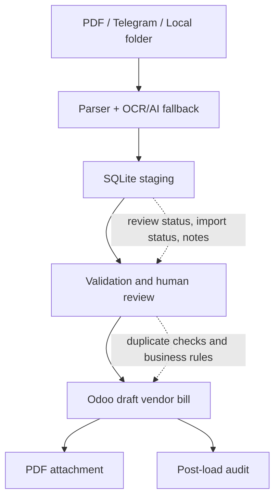

# AI-Assisted Invoice Processing for Procurement Operations

## Executive Summary

Vendor invoice intake is a high-friction point in procurement operations: invoices arrive through different channels, key fields must be interpreted correctly, and ERP entry needs to be accurate, traceable, and controlled.

I designed an MVP that turns unstructured PDF invoices into a reviewable workflow: invoice intake, OCR/AI-assisted parsing, SQLite staging, validation, human review, and controlled creation of draft vendor bills in Odoo.

The goal was not to automate blindly. The goal was to reduce manual retyping risk, preserve traceability, and create a safer base for procure-to-pay automation while keeping final approval in human hands.

## Why This Matters

Vendor invoices sit at a critical point in the procure-to-pay process. A small error in supplier identity, document number, tax treatment, currency, or amount can create duplicated records, delays, reconciliation issues, or rework across procurement and accounts payable.

At the same time, automating invoice intake without controls can be risky. A useful solution needs more than OCR: it needs staging before ERP writes, duplicate checks, auditability, and clear human review points.

This case matters because it frames AI as part of an operational control system, not as a shortcut around business validation.

## Business Problem

The process started from a common operational pain: vendor invoices were received as PDFs and needed to be interpreted before being loaded into Odoo.

The main risks were:

- manual retyping of invoice data;
- inconsistent interpretation of document numbers, dates, tax amounts, currencies, and suppliers;
- duplicated vendor bills;
- weak traceability between the original PDF and the ERP record;
- one-off fixes for specific invoice layouts instead of a repeatable process.

The objective was to create a controlled intake flow that could prepare ERP drafts for review, not replace the person responsible for approving them.

## Context

The environment involved procurement, accounts payable, vendor invoices, and Odoo as the ERP system.

Invoices could enter through a local folder or Telegram. The MVP was designed to complement an existing structured invoice import flow and add a more flexible channel for PDF-based intake.

All details in this draft are anonymized. Real vendors, tax IDs, amounts, documents, credentials, databases, local paths, and internal screenshots must remain private.

## My Role

I translated a messy administrative workflow into a controlled automation design.

My role included:

- defining the intake-to-ERP workflow;
- separating parsing, staging, validation, and ERP write operations;
- designing controls for duplicates, review states, attachments, and audit trail;
- using OCR/AI as a fallback layer, not as the source of final truth;
- keeping Odoo records in draft state for human review before posting;
- documenting the workflow so it could be reviewed, improved, and extended.

## Approach

I approached the case as a process and risk-control problem first, then as an automation problem.

The design principles were:

1. Capture invoices from practical intake channels.
2. Extract and normalize only the fields needed for a safe draft.
3. Stage parsed data before touching the ERP.
4. Flag uncertain documents for review instead of forcing automation.
5. Check for duplicates before creating ERP records.
6. Create Odoo vendor bills only as drafts.
7. Attach the original PDF and preserve technical context for auditability.

## Before / After

| Before | After |
|---|---|
| Manual invoice interpretation | Structured invoice intake pipeline |
| PDFs and notes handled across channels | Centralized staging with review status |
| ERP entry depended on manual retyping | Draft vendor bill prepared for review |
| Higher duplicate risk | Duplicate checks before ERP write |
| Weak link between source document and ERP record | Original PDF attached to the Odoo draft |
| AI/OCR could be treated as a black box | OCR/AI used as fallback inside a controlled workflow |
| Errors discovered late | Post-load audit and visible warning states |

## Solution

The MVP creates a controlled pipeline for invoice intake:

- PDFs are ingested from a local folder or Telegram.
- Python extracts invoice text and key fields.
- OCR and optional AI vision fallback support difficult documents.
- Parsed documents are stored in SQLite staging with review and import status.
- Human notes can clarify supplier, purchase order, logistics, or manual allocation context.
- The importer reads staged documents and creates Odoo draft vendor bills through XML-RPC.
- The original PDF is attached to the Odoo draft.
- Post-load audit checks are stored back in staging.

The core design choice is separation of responsibilities: parsing prepares data, staging holds it, validation decides whether it is safe, and the ERP write step only creates a draft for review.

## Architecture

```text
PDF folder / Telegram
        |
        v
Parser + OCR/AI fallback
        |
        v
SQLite staging
        |
        v
Validation / human review
        |
        v
Odoo draft vendor bill
        |
        +--> PDF attachment
        |
        v
Post-load audit
```

## Architecture Diagram



## Demo Artifacts

The `demo/` folder contains synthetic examples that illustrate the workflow without exposing private data:

- `sample_invoice_payload.json`: a fictitious parsed invoice payload.
- `sample_staging_record.json`: a fictitious staging record before ERP write.
- `sample_audit_result.json`: a fictitious post-load audit result.

These files are not based on real invoices, real suppliers, real Odoo records, real logs, or real SQLite data. They are included only to make the design easier to understand.

## Tools & Methods

- Python for orchestration, parsing, validation, and ERP integration.
- Odoo XML-RPC for controlled creation of draft vendor bills.
- Telegram Bot API for invoice intake and user notes.
- SQLite for staging and audit trail before ERP write operations.
- pdfplumber for embedded PDF text extraction.
- PyMuPDF and Tesseract as local OCR fallback when available.
- Gemini Vision as an optional fallback for difficult PDFs.
- pandas/openpyxl for spreadsheet-based reference data and checks.
- Functional contracts and handoff documents to preserve business rules.

## Validation & Controls

The differentiator of this case is not simply using OCR or AI. The differentiator is the control structure around it.

The MVP includes:

- Draft-only creation in Odoo. Final posting remains manual.
- Duplicate detection based on document type, supplier, and document number.
- SQLite staging before writing to Odoo.
- Human review when parsing confidence is low or required fields are missing.
- Human notes for ambiguous cases such as supplier hints, purchase order references, logistics, or manual allocations.
- Supplier resolution through structured references, not free-form guessing.
- Separation between parsing, validation, and ERP write operations.
- PDF attachment to the generated Odoo draft.
- Internal technical notes on the Odoo draft for traceability.
- Post-load audit of lines, amounts, taxes, labels, attachment, and warnings.

## What Makes This Case Different

This project does not try to remove human judgment from accounts payable.

It prepares structured, traceable information so a person can review the draft before the ERP record is finalized. That distinction matters: automation is useful only when it improves speed and consistency without hiding operational risk.

The result is a safer automation pattern: intake first, staging second, validation third, draft creation fourth, and human approval before final posting.

## Impact

The MVP supports qualitative operational improvements without claiming unsupported metrics:

- reduced manual retyping in vendor invoice intake;
- lower duplicate risk through pre-write checks;
- better traceability from source PDF to ERP draft;
- standardized intake across folder-based and Telegram-based channels;
- clearer human review points for ambiguous documents;
- better auditability after draft creation;
- a safer foundation for future procure-to-pay automation.

No quantitative savings, success rate, volume processed, or accuracy metric is claimed in this draft because those numbers are not yet supported by sanitized evidence.

## Recruiter Signal

This case demonstrates the ability to turn a messy administrative process into a controlled operational system.

It shows:

- procurement and accounts payable process understanding;
- procure-to-pay workflow awareness;
- risk-aware automation design;
- practical ERP/Odoo integration experience;
- Python-based automation and data validation;
- pragmatic use of OCR/AI inside business controls;
- structured thinking around staging, auditability, and human review;
- ability to connect operational pain points with scalable internal tooling.

## What I Learned

- ERP automation needs control points, not only data extraction.
- OCR and AI are most useful when placed behind validation and review states.
- Staging is essential when the source data is messy or semi-structured.
- Draft creation is a safer first automation target than automatic posting.
- Business rules around taxes, document types, currencies, suppliers, and duplicate detection are as important as the parser itself.

## Next Steps

- Build a public demo dataset with fictional invoices and suppliers.
- Replace all private vendors, tax IDs, amounts, screenshots, and paths with placeholders or synthetic examples.
- Add a sanitized example of a staged invoice payload.
- Add a sanitized example of an audit result.
- Create a cleaner public diagram if this case moves into the public portfolio.
- Define public metrics only after they are supported by safe evidence.
