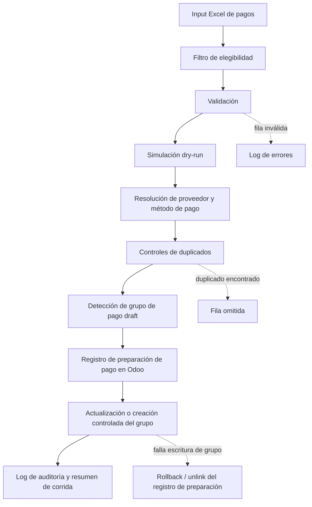

English version: [README.md](README.md)

# Risk-Controlled Payment Preparation Workflow in Odoo

Case type: Procure-to-pay automation / ERP workflow / Risk-controlled operations

## Executive Summary

La preparación de órdenes de pago es una parte sensible del proceso procure-to-pay: conecta saldos de proveedores, métodos de pago, fechas contables, monedas y registros de preparación dentro del ERP.

Diseñé un workflow controlado para preparar registros de órdenes de pago en Odoo a partir de un input estructurado. El flujo incluye validación, simulación dry-run, resolución de proveedores, controles de método de pago, prevención de duplicados, agrupación de pagos, logging de errores y escritura controlada en ERP.

El objetivo no era aprobar pagos ni ejecutar transferencias bancarias. El objetivo era reducir riesgo de preparación, hacer visibles las excepciones y crear una base más segura para automatización de cuentas a pagar manteniendo la revisión financiera.

## Why This Matters

La preparación de pagos está cerca del cash-flow, las relaciones con proveedores, los controles contables y la auditabilidad. Un error manual en proveedor, importe, moneda, método de pago o preparación duplicada puede generar fricción operativa y riesgo financiero.

Automatizar en esta área requiere controles fuertes. Un workflow útil debe validar inputs, simular acciones antes de escribir en el ERP, detectar duplicados, preservar trazabilidad y hacer visibles las excepciones antes de crear cualquier registro de preparación.

Este caso trata la automatización ERP como un sistema de control, no solo como un atajo de carga de datos.

## Business Problem

La necesidad operativa era preparar registros de órdenes de pago de proveedores en Odoo desde una planilla estructurada, reduciendo el riesgo de preparación manual.

Los principales riesgos eran:

- recarga manual de datos de pago;
- inconsistencias entre proveedores del input y contactos de Odoo;
- selección incorrecta de diario o método de pago;
- preparación duplicada de pagos;
- grupos de pago que mezclan contexto incompatible de proveedores;
- baja visibilidad de filas omitidas, rechazadas y errores de escritura ERP;
- dificultad para revisar qué pasaría antes de escribir registros de preparación en Odoo.

El objetivo era crear un workflow de precarga controlado que pudiera simular, validar y luego preparar o actualizar registros de Odoo solo cuando el input pasara los controles requeridos.

## Context

El workflow pertenece a compras, cuentas a pagar y operaciones procure-to-pay.

La fuente es un archivo Excel de preparación de pagos. Odoo es el ERP destino. El flujo resuelve proveedores, métodos de pago, diarios, monedas, fechas efectivas, referencias de factura cuando aplica y contexto de grupo de pago antes de escribir registros de preparación.

Todo detalle público está anonimizado. Proveedores reales, importes, identificadores de Odoo, diarios, métodos de pago, configuración contable, logs, planillas, credenciales y rutas locales permanecen privados.

## My Role

Traducí un workflow sensible de cuentas a pagar en un diseño de automatización controlada.

Mi rol incluyó:

- mapear el flujo desde input Excel hasta registros de preparación en Odoo;
- separar validación, simulación y escritura ERP;
- diseñar comportamiento dry-run antes de operaciones de escritura;
- agregar resolución de proveedor y método de pago;
- sumar controles de duplicados antes de crear registros ERP;
- manejar detección, actualización o creación controlada de grupos de pago;
- diseñar manejo de errores y rollback alrededor de escrituras ERP;
- crear salidas de auditoría y revisión para soportar trazabilidad.

## Approach

Abordé el caso primero como un problema de control financiero-operativo y después como un problema de automatización.

Los principios de diseño fueron:

1. Procesar solo filas explícitamente marcadas para carga en Odoo.
2. Validar proveedor, importe, fecha, diario, método de pago y moneda antes de escribir en ERP.
3. Soportar modo dry-run para previsualizar qué se prepararía o actualizaría.
4. Resolver grupos de pago draft existentes cuando correspondiera.
5. Evitar duplicados usando una clave estructurada de pago.
6. Agrupar pagos relacionados sin mezclar contextos incompatibles.
7. Registrar filas omitidas, errores de validación y errores de escritura ERP.
8. Revertir el registro de preparación si falla la creación o actualización del grupo.

## Before / After

| Before | After |
|---|---|
| Preparación manual de pagos desde planillas | Workflow estructurado de precarga de pagos |
| Impacto ERP dependiente de carga manual | Validación y dry-run antes de escribir en ERP |
| Duplicados controlados principalmente por memoria del revisor | Controles de duplicados usando atributos de pago |
| Grupos de pago preparados manualmente | Detección de grupos draft existentes o creación controlada |
| Errores detectados durante o después de la carga | Errores de validación y logs explícitos |
| Resolución de proveedor y método manejada ad hoc | Resolución estructurada de proveedor, diario, método y moneda |
| Baja trazabilidad de filas omitidas o rechazadas | Resumen de corrida, filas omitidas y log de errores revisables |

## Solution

El MVP lee un input estructurado de pagos, valida filas elegibles, resuelve referencias de Odoo, simula la acción esperada en modo dry-run y luego prepara o actualiza registros en Odoo solo cuando los controles pasan.

No aprueba pagos, no contabiliza decisiones finales, no ejecuta transferencias bancarias ni reemplaza revisión financiera. Prepara registros y grupos controlados en ERP para que una persona revise desde una base más estructurada y trazable.

El workflow incluye:

- lectura de input Excel de pagos;
- filtro explícito tipo `load_to_odoo`;
- resolución de proveedores mediante contactos de Odoo y mapeos de referencia;
- validación de diario y método de pago;
- manejo de moneda;
- lookup de referencias de factura en casos soportados;
- prevención de duplicados usando atributos de pago;
- detección de grupos de pago draft;
- preparación controlada de pagos y actualización o creación de grupos mediante Odoo XML-RPC;
- rollback si falla el paso de grupo después de crear un registro de preparación;
- logging de errores, proveedores omitidos y resúmenes de corrida.

La decisión central de diseño es control antes de escritura: dry-run primero, validación después, escritura ERP solo cuando la fila es elegible y resoluble.

## Architecture

```text
Input Excel de pagos
        |
        v
Parsing y filtro de elegibilidad
        |
        v
Validación
        |
        v
Simulación dry-run
        |
        v
Resolución de proveedor / diario / método / moneda
        |
        v
Duplicados y detección de grupo de pago
        |
        v
Registro de preparación de pago en Odoo
        |
        v
Actualización o creación controlada del grupo
        |
        v
Log de auditoría y resumen
```

## Architecture Diagram



## Demo Artifacts

La carpeta `demo/` contiene ejemplos sintéticos que ilustran el workflow sin exponer datos privados:

- `sample_payment_input.json`: input ficticio de precarga de pago.
- `sample_dry_run_result.json`: resultado ficticio de dry-run.
- `sample_payment_group_result.json`: resultado ficticio de preparación de grupo de pago.
- `sample_audit_summary.json`: resumen ficticio de auditoría.

Estos archivos no están basados en proveedores reales, facturas reales, pagos reales, registros reales de Odoo, logs reales ni datos contables reales. Solo se incluyen para facilitar la comprensión del diseño de control.

## Tools & Methods

- Python para orquestación, validación e integración ERP.
- pandas/openpyxl para manejo de input Excel estructurado.
- Odoo XML-RPC para operaciones controladas de preparación en ERP.
- Modo dry-run antes de escritura ERP.
- Resolución de proveedor, diario, método de pago y moneda.
- Prevención de duplicados mediante claves estructuradas de pago.
- Detección, actualización o creación controlada de grupos de pago.
- Logging de errores y resúmenes de corrida.
- Exportaciones de estilo auditoría para revisión y conciliación.

## Validation & Controls

El diseño de control incluye:

- Dry-run antes de escritura ERP.
- Filtro explícito de elegibilidad por fila.
- Resolución de proveedor antes de crear registros de preparación.
- Validación de diario y método de pago.
- Manejo de moneda donde el input y la configuración de Odoo lo soportan.
- Matching de factura/pago cuando existe una referencia soportada.
- Prevención de duplicados usando atributos de pago.
- Detección de grupos de pago draft antes de crear uno nuevo.
- Actualización o creación controlada de grupos.
- Rollback/unlink si el registro de preparación fue creado pero falla la operación de grupo.
- Salidas de auditoría y resúmenes de corrida.
- Logging explícito de filas rechazadas, proveedores no resueltos, importes inválidos, fechas inválidas, diarios o métodos no resueltos y fallas de escritura ERP.

## What Makes This Case Different

Este proyecto no intenta automatizar pagos sin revisión.

Crea una capa de preparación más segura para un workflow financiero sensible. El valor está en volver el proceso más estructurado, trazable y revisable antes de escribir registros en Odoo.

La decisión más fuerte es separar simulación y escritura controlada: el dry-run muestra qué ocurriría, mientras que el modo write prepara registros solo después de validación y resolución.

## What This Does Not Do

Este workflow es una capa de preparación y control. No:

- aprueba pagos a proveedores;
- ejecuta transferencias bancarias;
- mueve fondos;
- reemplaza revisión de cuentas a pagar o finanzas;
- afirma KPIs productivos;
- afirma tasas de éxito de ejecución de pagos;
- publica datos reales de proveedores, facturas, pagos, impuestos, diarios u Odoo.

Prepara registros ERP controlados para revisión y hace más visibles las excepciones antes de que el flujo avance dentro del proceso de pagos.

## Impact

El workflow habilita mejoras operativas cualitativas sin afirmar métricas no sustentadas:

- menor riesgo de preparación manual;
- mejor trazabilidad en preparación de pagos;
- operaciones de escritura ERP más seguras;
- excepciones más visibles;
- menor riesgo de preparación duplicada;
- base más fuerte para automatización procure-to-pay;
- mejor visibilidad de ítems omitidos, rechazados y preparados.

No se afirman ahorros cuantitativos, tasa de éxito, volumen procesado ni reducción de errores porque esos números no están respaldados por evidencia sanitizada en esta versión pública.

## Recruiter Signal

Este caso demuestra capacidad de automatizar un workflow operativo sensible sin debilitar controles financieros.

Muestra:

- entendimiento del proceso procure-to-pay;
- conocimiento de cuentas a pagar y workflow de pagos;
- experiencia automatizando ERP/Odoo;
- diseño de automatización con control de riesgo;
- validación e integración con Python;
- manejo de excepciones y logging operativo;
- control de operaciones financieras;
- disciplina de calidad de datos y tratamiento de excepciones;
- pensamiento operativo sobre trazabilidad y puntos de control;
- capacidad de convertir un proceso de planillas en un workflow estructurado de ERP.

## What I Learned

- La automatización de operaciones financieras necesita previsualización y control antes de escribir.
- Dry-run no es un extra; es un mecanismo central de seguridad.
- La prevención de duplicados necesita claves estructuradas, no solo memoria humana.
- Los grupos de pago agregan contexto operativo que debe validarse, no asumirse.
- El rollback importa cuando un workflow crea varios registros relacionados en ERP.
- Logs y salidas de auditoría son parte del producto, no un agregado final.

## Next Steps

- Revisar wording público antes de publicar.
- Extender el dataset demo sintético con escenarios adicionales de excepción.
- Agregar un diagrama público simple si el caso se expande dentro del portfolio.
- Considerar pseudocódigo sanitizado solo después de confirmar que no expone configuración privada ni reglas de negocio.
- Definir métricas públicas solo si pueden respaldarse con evidencia segura y anonimizada.
