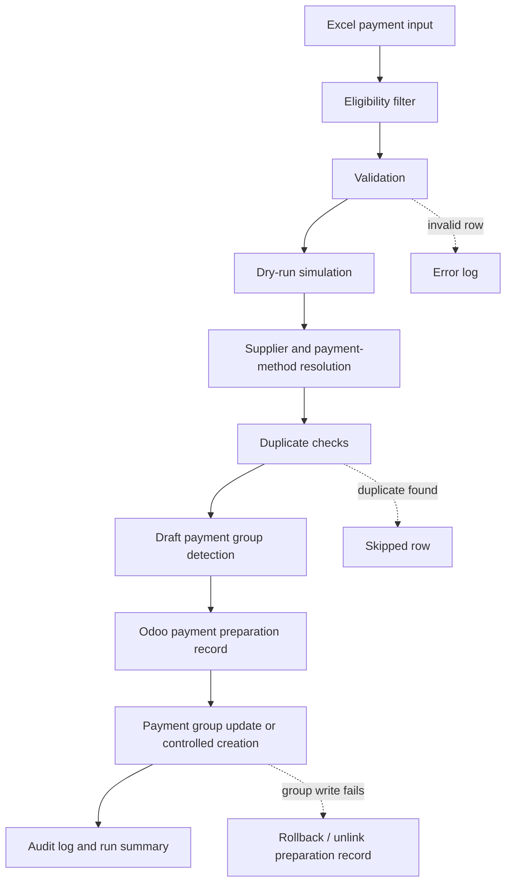

# Risk-Controlled Payment Preparation Workflow in Odoo

Spanish version: [README.es.md](README.es.md)

Case type: Procure-to-pay automation / ERP workflow / Risk-controlled operations

## Executive Summary

Payment order preparation is a sensitive part of procure-to-pay operations: it connects supplier balances, payment methods, accounting dates, currencies, and ERP preparation records.

I designed a controlled workflow to prepare payment-order records in Odoo from a structured payment input. The flow includes validation, dry-run simulation, supplier resolution, payment method checks, duplicate prevention, payment grouping, error logging, and controlled ERP writes.

The objective was not to approve payments or execute bank transfers. The objective was to reduce preparation risk, make exceptions visible, and create a safer foundation for accounts payable automation while keeping financial review intact.

## Why This Matters

Payment-order preparation sits close to cash-flow planning, supplier relationships, accounting controls, and auditability. A manual error in supplier selection, amount, currency, payment method, or duplicate preparation can create operational friction and financial risk.

Automation in this area needs strong controls. A useful workflow should validate inputs, simulate actions before writing to the ERP, detect duplicates, preserve traceability, and make exceptions visible before any ERP preparation record is created.

This case matters because it treats ERP automation as a control system, not just as a data-entry shortcut.

## Business Problem

The operating need was to prepare supplier payment-order records in Odoo from a structured payment worksheet while reducing manual preparation risk.

The main risks were:

- manual retyping of payment data;
- supplier mismatches between the input file and Odoo contacts;
- incorrect journal or payment method selection;
- duplicate payment preparation;
- payment groups that mix incompatible supplier context;
- weak visibility into skipped rows, rejected rows, and ERP write errors;
- difficulty reviewing what would happen before writing preparation records in Odoo.

The goal was to create a controlled preload workflow that could simulate, validate, and then prepare or update Odoo records only when the input passed the required checks.

## Context

The workflow belongs to procurement, accounts payable, and procure-to-pay operations.

The source input is an Excel-based payment preparation file. Odoo is the target ERP. The workflow resolves suppliers, payment methods, journals, currencies, effective dates, invoice references when applicable, and payment group context before writing ERP preparation records.

All public details are anonymized. Real suppliers, amounts, Odoo identifiers, journals, payment methods, accounting configuration, logs, spreadsheets, credentials, and local paths remain private.

## My Role

I translated a sensitive accounts payable workflow into a controlled automation design.

My role included:

- mapping the payment preload workflow from Excel input to Odoo preparation records;
- separating validation, simulation, and ERP write actions;
- designing dry-run behavior before production write operations;
- adding supplier and payment-method resolution logic;
- adding duplicate checks before creating ERP records;
- handling payment group detection, update, or creation;
- designing error handling and rollback behavior around ERP writes;
- creating audit and review outputs to support traceability.

## Approach

I approached the case as a financial operations control problem first and an automation problem second.

The design principles were:

1. Process only rows explicitly marked for Odoo loading.
2. Validate supplier, amount, date, journal, payment method, and currency before ERP write.
3. Support dry-run mode to preview what would be prepared or updated.
4. Resolve existing draft payment groups where appropriate.
5. Prevent duplicate payment lines using a structured payment key.
6. Group related payments without mixing incompatible supplier context.
7. Log skipped rows, validation errors, and ERP write errors.
8. Roll back the preparation record if group update or creation fails.

## Before / After

| Before | After |
|---|---|
| Manual payment preparation from spreadsheets | Structured payment preload workflow |
| ERP impact depends on manual data entry | Validation and dry-run before ERP write |
| Duplicate risk handled mostly by reviewer memory | Duplicate checks using payment attributes |
| Payment groups prepared manually | Existing draft group detection or controlled preparation group creation |
| Errors discovered during or after ERP entry | Explicit validation errors and logging |
| Supplier and payment method resolution handled ad hoc | Structured supplier, journal, method, and currency resolution |
| Weak traceability of skipped or rejected rows | Reviewable run summary, skipped rows, and error log |

## Solution

The MVP reads a structured payment input, validates eligible rows, resolves Odoo references, simulates the intended ERP action in dry-run mode, and then prepares or updates Odoo records only when controls pass.

It does not approve payments, post final accounting decisions, execute bank transfers, or replace financial review. It prepares controlled ERP records and groups so a reviewer can work from a more structured and traceable base.

The workflow includes:

- Excel payment input parsing;
- explicit `load_to_odoo` style filtering;
- supplier resolution through Odoo contacts and reference mappings;
- journal and payment method validation;
- currency handling;
- invoice reference lookup for specific cases where supported;
- duplicate prevention using payment attributes;
- draft payment group detection;
- controlled payment preparation and payment group update or creation through Odoo XML-RPC;
- rollback behavior if the group step fails after creating a preparation record;
- logging of errors, skipped suppliers, and run summaries.

The core design choice is control before write: dry-run first, validation second, ERP write only when the row is eligible and resolvable.

## Architecture

```text
Excel payment input
        |
        v
Input parsing and eligibility filter
        |
        v
Validation
        |
        v
Dry-run simulation
        |
        v
Supplier / journal / method / currency resolution
        |
        v
Duplicate checks and payment group detection
        |
        v
Odoo payment preparation record
        |
        v
Payment group update or controlled creation
        |
        v
Audit log and run summary
```

## Architecture Diagram



## Demo Artifacts

The `demo/` folder contains synthetic examples that illustrate the workflow without exposing private data:

- `sample_payment_input.json`: a fictitious payment preload input.
- `sample_dry_run_result.json`: a fictitious dry-run result.
- `sample_payment_group_result.json`: a fictitious payment group preparation result.
- `sample_audit_summary.json`: a fictitious audit summary.

These files are not based on real suppliers, real invoices, real payments, real Odoo records, real logs, or real accounting data. They are included only to make the control design easier to understand.

## Tools & Methods

- Python for orchestration, validation, and ERP integration.
- pandas/openpyxl for structured Excel input handling.
- Odoo XML-RPC for controlled ERP preparation operations.
- Dry-run mode before ERP write.
- Supplier, journal, payment method, and currency resolution.
- Duplicate prevention through structured payment keys.
- Payment group detection, update, or controlled creation.
- Error logging and run summaries.
- Audit-style exports for review and reconciliation.

## Validation & Controls

The control design includes:

- Dry-run before ERP write.
- Explicit row eligibility filtering.
- Supplier resolution before creating ERP preparation records.
- Journal and payment method validation.
- Currency handling where supported by the input and Odoo configuration.
- Invoice/payment matching where a supported invoice reference is available.
- Duplicate prevention using payment attributes.
- Draft payment group detection before creating a new group.
- Payment group update or controlled creation.
- Rollback/unlink behavior if the preparation record was created but the group operation fails.
- Audit outputs and run summaries.
- Explicit error logging for rejected rows, unresolved suppliers, invalid amounts, invalid dates, unresolved journals, unresolved methods, and ERP write failures.

## What Makes This Case Different

This project does not try to automate payments without review.

It creates a safer preparation layer for a sensitive financial workflow. The value is in making the process structured, traceable, and reviewable before records are written to Odoo.

The strongest design choice is the separation between simulation and controlled ERP write: dry-run shows what would happen, while write mode prepares records only after validation and resolution.

## What This Does Not Do

This workflow is a preparation and control layer. It does not:

- approve supplier payments;
- execute bank transfers;
- move funds;
- replace accounts payable or finance review;
- claim production KPIs;
- claim payment execution success rates;
- publish real supplier, invoice, payment, tax, journal, or Odoo data.

It prepares controlled ERP records for review and makes exceptions more visible before the workflow moves further in the payment process.

## Impact

The workflow supports qualitative operational improvements without claiming unsupported metrics:

- supports lower manual preparation risk;
- improves payment-preparation traceability;
- supports safer ERP write operations;
- makes exceptions more visible;
- supports lower duplicate preparation risk;
- creates a stronger basis for procure-to-pay automation;
- improves visibility into skipped, rejected, and prepared items.

No quantitative savings, success rate, volume processed, or error reduction metric is claimed in this public version because those numbers are not yet supported by sanitized evidence.

## Recruiter Signal

This case demonstrates the ability to automate a sensitive operational workflow without weakening financial controls.

It shows:

- procure-to-pay process understanding;
- accounts payable and payment workflow awareness;
- ERP/Odoo automation experience;
- risk-aware automation design;
- Python-based validation and integration;
- exception handling and operational logging;
- financial operations control;
- data quality and exception-handling discipline;
- operational thinking around traceability and control points;
- ability to turn a spreadsheet-driven process into a structured ERP workflow.

## What I Learned

- Financial operations automation needs preview and control before write operations.
- Dry-run is not a nice-to-have; it is a core safety mechanism.
- Duplicate prevention needs structured keys, not only human memory.
- Payment groups add operational context that must be validated, not assumed.
- Rollback behavior matters when a workflow creates multiple related ERP records.
- Logs and audit outputs are part of the product, not an afterthought.

## Next Steps

- Review the public wording before publishing.
- Extend the synthetic demo dataset with additional exception scenarios.
- Add a simple public diagram if this case moves into the public portfolio.
- Consider sanitized pseudocode only after confirming it exposes no private configuration or business rules.
- Define public metrics only if they can be supported by safe, anonymized evidence.
