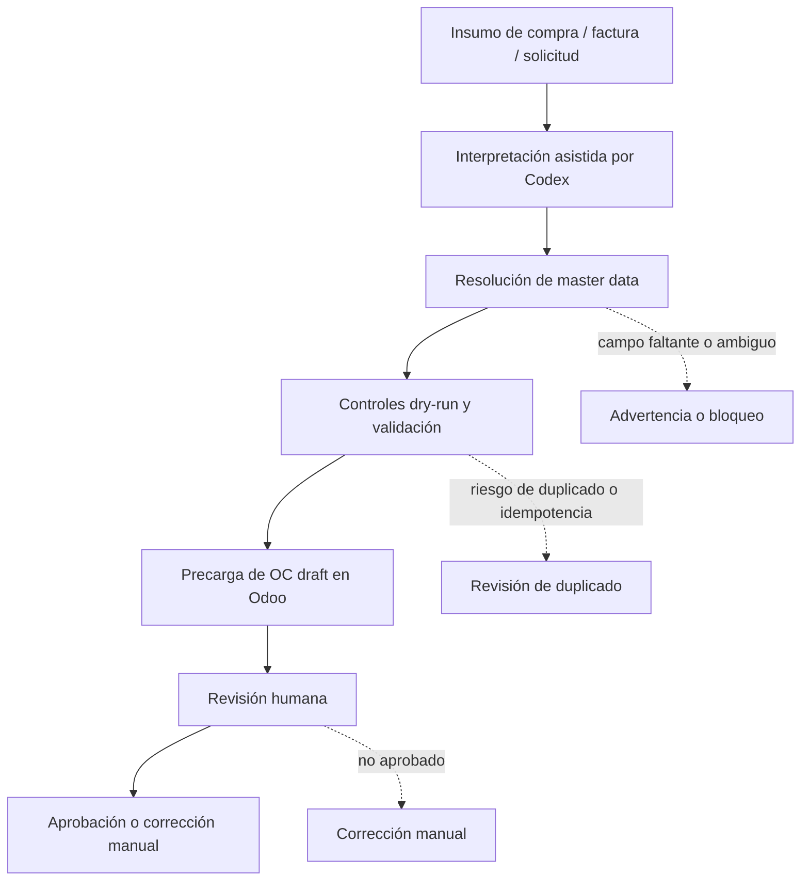

English version: [README.md](README.md)

# Human-in-the-Loop Purchase Order Preload into Odoo

Case type: Procurement automation / AI-assisted operations / Human-in-the-loop ERP workflow

## Executive Summary

Este caso documenta un workflow asistido por IA para preparar órdenes de compra y precargarlas en Odoo en estado draft para revisión humana.

El workflow usó Codex como asistente operativo: se interpretaban insumos de compra, facturas o solicitudes, se resolvían los campos necesarios para la orden de compra y se preparaban registros draft en Odoo para validación manual.

La decisión clave no fue quitar criterio humano. El proceso combinó preparación asistida por IA, resolución de maestros, controles dry-run de validación, precarga ERP en draft y aprobación humana antes de cualquier confirmación de orden de compra.

## Why This Matters

Las órdenes de compra son un punto de control dentro de operaciones de procurement. Están antes de compromisos con proveedores, recepción, matching de facturas, control de costos y accountability operativa.

Un proceso débil de preparación de órdenes de compra puede generar problemas posteriores:

- selección incorrecta de proveedor;
- producto o unidad de medida incorrectos;
- moneda, impuesto o destino logístico incorrecto;
- preparación duplicada;
- baja trazabilidad entre la solicitud original y el draft en ERP;
- creación prematura de registros que aún necesitan revisión de negocio.

El valor de este workflow es preparar registros estructurados y revisables, manteniendo la decisión final en una persona.

## Business Problem

El problema operativo era convertir insumos de compra en órdenes de compra draft utilizables en Odoo sin perder control.

Esos insumos podían venir de facturas, solicitudes de compra u otro contexto de procurement. Preparar una orden manualmente requería interpretar el pedido, resolver proveedor y producto, revisar unidades, impuestos, moneda y destino logístico, y crear un draft ERP con suficiente cuidado para revisión.

El objetivo era reducir fricción de preparación manual sin caer en automatización descontrolada. Las órdenes de compra debían ser más fáciles de preparar, pero seguir revisadas y aprobadas por una persona antes de la confirmación.

## Context

El caso pertenece a operaciones de procurement y mejora del proceso procure-to-pay.

Está ubicado antes en el ciclo P2P que la ingesta de facturas y la preparación de pagos: se enfoca en preparar la orden de compra, no en aprobar una factura de proveedor ni preparar un pago.

Todo el contenido público está anonimizado. Proveedores reales, productos, precios, cantidades, impuestos, números de orden de compra, identificadores de Odoo, facturas, capturas, logs y datos de la empresa no están incluidos.

## Evidence Boundary

Este caso combina dos niveles de evidencia:

- una capa versionada de dry-run / validación que documenta resolución de maestros, agrupación, controles de duplicados, idempotencia y salidas auditables;
- evidencia operativa privada de que órdenes de compra fueron precargadas en Odoo en estado draft y luego revisadas por una persona.

La versión pública no expone registros operativos crudos, capturas, datos de proveedores, IDs de Odoo ni un módulo reusable público de `purchase.order.create`.

## My Role

Mi rol fue estructurar y operar un workflow human-in-the-loop para preparación de órdenes de compra.

Usé Codex como asistente operativo para interpretar insumos de procurement, resolver información faltante o ambigua de la orden de compra y preparar registros para revisión en Odoo draft.

También mantuve el límite de control: el output no se trataba como aprobación automática. Yo revisaba, validaba y aprobaba manualmente antes de confirmar cualquier orden de compra.

## Approach

El enfoque combinó asistencia operativa con controles de riesgo:

1. Partir de un insumo de compra, factura o solicitud.
2. Usar Codex para interpretar el input e identificar campos requeridos de la orden de compra.
3. Resolver proveedor, producto, unidad de medida, moneda, impuesto y contexto de picking/logística.
4. Usar lógica de dry-run / validación como capa de control cuando estuviera disponible.
5. Precargar la orden de compra en Odoo en estado draft.
6. Revisar manualmente el draft.
7. Aprobar o confirmar solo después de validación humana.

La capa dry-run es importante, pero no es toda la historia. Apoya validación y auditabilidad dentro de un workflow operativo más amplio que produjo registros draft en Odoo para revisión.

## Before / After

| Before | After |
|---|---|
| Interpretación manual de facturas o insumos de compra | Interpretación de contexto de compra asistida por Codex |
| Campos de OC resueltos manualmente uno por uno | Resolución estructurada de proveedor, producto, UoM, moneda, impuesto y picking |
| La revisión depende de notas, memoria o controles manuales | Draft preload más salidas de validación y puntos de revisión |
| Mayor riesgo de preparar registros con contexto incompleto | Capa dry-run / validación antes o alrededor de la preparación draft en ERP |
| Preparar el draft en ERP es más lento y difícil de trazar | Orden de compra draft preparada en Odoo para validación humana |
| La aprobación final depende igualmente de una persona | La aprobación final queda explícitamente bajo control humano |

## Solution

La solución es un workflow de preparación human-in-the-loop.

El flujo ayuda a transformar un insumo de compra en una orden de compra draft estructurada en Odoo. Codex asiste con interpretación y resolución de campos, la capa de validación ayuda a exponer bloqueos y advertencias, y Odoo recibe un registro draft para revisión manual.

El proceso está intencionalmente delimitado. Prepara registros draft; no confirma automáticamente órdenes de compra, no aprueba compras y no reemplaza criterio de procurement.

El valor público del caso está en el diseño del workflow: preparación asistida por IA, validación antes del compromiso final en ERP, precarga draft y control humano explícito.

## Architecture

```text
Insumo de compra / factura / solicitud
        |
        v
Interpretación asistida por Codex
        |
        v
Resolución de proveedor / producto / UoM / moneda / impuesto / picking
        |
        v
Controles dry-run y validación
        |
        v
Precarga de orden de compra draft en Odoo
        |
        v
Revisión y validación humana
        |
        v
Aprobación / confirmación manual cuando corresponde
```

## Architecture Diagram



## Demo Artifacts

La carpeta `demo/` contiene ejemplos sintéticos:

- `sample_purchase_input.json`: insumo de compra ficticio.
- `sample_ai_resolution.json`: resolución ficticia de campos asistida por IA.
- `sample_validation_result.json`: resultado ficticio de validación / dry-run.
- `sample_odoo_draft_preload.json`: representación ficticia de una precarga draft de orden de compra en Odoo.
- `sample_human_review_checklist.json`: checklist ficticio de revisión humana.
- `sample_audit_trail.json`: trazabilidad ficticia desde el input hasta la revisión del draft.

Estos archivos no están basados en proveedores, productos, órdenes de compra, facturas, precios, impuestos, registros de Odoo, logs, capturas ni datos de empresa reales.

## Tools & Methods

- Codex para interpretación operativa y preparación asistida por IA.
- Odoo como entorno ERP para revisión de órdenes de compra draft.
- Python / capa dry-run para validación y controles orientados a auditoría.
- Contexto histórico de maestros para apoyar resolución de campos.
- Validación estructurada de proveedor, producto, unidad de medida, moneda, impuesto y picking.
- Criterios de duplicados e idempotencia para reducir riesgo de preparación.
- Revisión human-in-the-loop antes de aprobación o confirmación.

## Validation & Controls

El workflow enfatiza control antes del compromiso final en ERP:

- solo estado draft antes de revisión humana;
- aprobación humana antes de confirmar la orden de compra;
- validación dry-run cuando está disponible;
- resolución de proveedor y producto;
- controles de unidad de medida, moneda, impuesto y picking;
- controles de duplicados e idempotencia;
- salidas auditables de la capa de validación;
- separación explícita entre preparación y aprobación;
- sin confirmación automática.

## What This Does Not Do

Este caso no afirma que el workflow:

- confirme órdenes de compra automáticamente;
- apruebe compras automáticamente;
- reemplace criterio de procurement;
- opere con autonomía completa;
- publique proveedores, productos, precios, impuestos, IDs de Odoo, facturas o números de OC reales;
- entregue KPIs cuantificados, ahorros, volumen, tasa de éxito o reducción de errores;
- exponga un módulo público reusable de `purchase.order.create`.

El caso trata sobre preparación asistida por IA y precarga draft con revisión humana, no sobre compras autónomas.

## Impact

El impacto es cualitativo y operativo:

- ayuda a preparar órdenes de compra más rápido;
- reduce fricción de preparación manual;
- mejora la visibilidad de gaps de master data antes de la revisión;
- mejora trazabilidad desde el input hasta el draft de Odoo;
- crea un workflow ERP human-in-the-loop más seguro;
- da a usuarios de procurement una mejor superficie de revisión antes de aprobar.

No se afirman ahorros cuantificados, volumen productivo, tasa de éxito ni reducción de errores.

## Recruiter Signal

Este caso demuestra:

- entendimiento de operaciones de procurement;
- uso práctico de IA en workflows administrativos;
- conocimiento de Odoo / ERP;
- resolución de master data;
- automatización con conciencia de riesgo;
- diseño human-in-the-loop;
- capacidad de convertir insumos de compra desordenados en drafts ERP controlados;
- criterio operativo sobre dónde debe detenerse la automatización;
- separación clara entre asistencia IA, preparación ERP y aprobación de negocio.

## What I Learned

- La automatización de órdenes de compra necesita límites fuertes porque está cerca de compromisos con proveedores.
- La asistencia IA es más útil cuando prepara trabajo estructurado para revisión, no cuando oculta incertidumbre.
- La resolución de master data suele ser el cuello de botella real en automatización de procurement.
- El estado draft es un punto de control potente: permite que la automatización ayude sin quitar accountability humana.
- Un buen workflow debe hacer visibles bloqueos, advertencias y supuestos antes de aprobar.

## Next Steps

- Crear un paquete demo público completamente sintético si este caso se expande.
- Agregar referencias privadas redactadas de evidencia de órdenes draft cuando corresponda.
- Crear diagramas y outputs demo seguros para publicación.
- Mantener la capa dry-run como sección de validación, no como posicionamiento principal.
- Comparar este caso contra CRM/leads antes de decidir el orden de futuras publicaciones.
