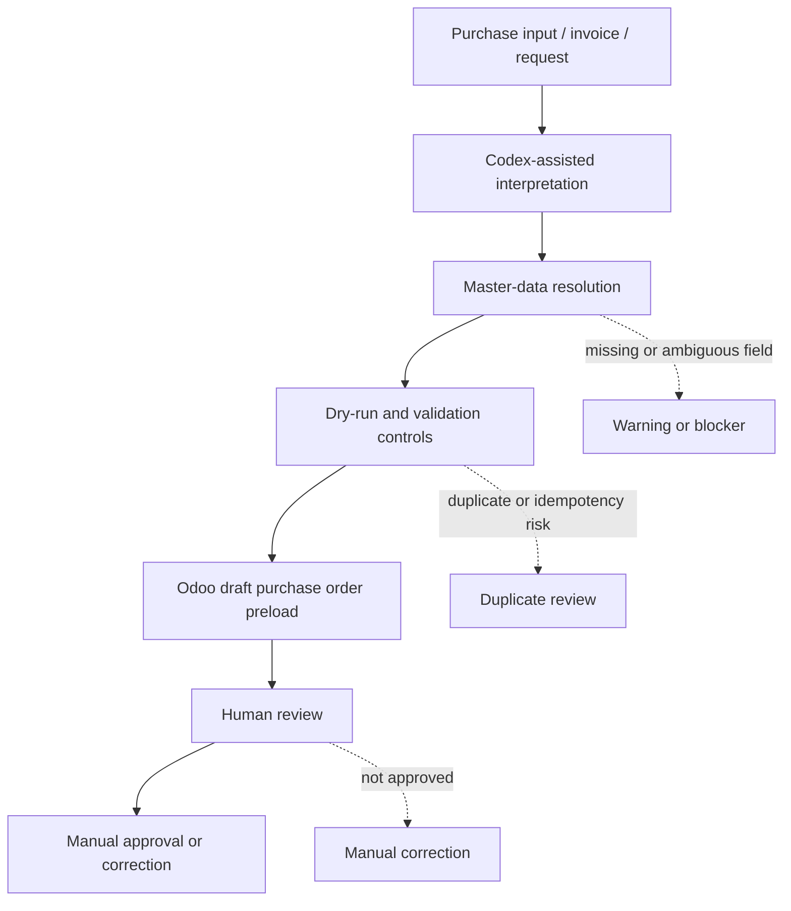

# Human-in-the-Loop Purchase Order Preload into Odoo

Spanish version: [README.es.md](README.es.md)

Case type: Procurement automation / AI-assisted operations / Human-in-the-loop ERP workflow

## Executive Summary

This case documents an AI-assisted workflow for preparing purchase orders and preloading them into Odoo in draft state for human review.

The workflow used Codex as an operational assistant: purchase inputs, invoices, or procurement requests were interpreted, required purchase-order fields were resolved, and draft records were prepared in Odoo for manual validation.

The key design choice was not to remove human judgment. The process combined AI-assisted preparation, master-data resolution, dry-run validation controls, draft ERP preload, and human approval before any purchase order confirmation.

## Why This Matters

Purchase orders are a control point in procurement operations. They sit upstream of supplier commitments, receiving, invoice matching, cost control, and operational accountability.

A weak purchase-order preparation process can create downstream issues:

- wrong supplier selection;
- wrong product or unit of measure;
- incorrect currency, tax, or logistics destination;
- duplicated preparation;
- weak traceability between the original request and the ERP draft;
- premature creation of records that still need business review.

The value of this workflow is that it prepares structured, reviewable draft records while keeping the final decision with a person.

## Business Problem

The operational problem was turning purchase inputs into usable Odoo draft purchase orders without losing control.

Those inputs could come from invoices, purchase requests, or other procurement context. Preparing an order manually required interpreting the request, resolving supplier and product context, checking units, taxes, currency, and logistics destination, and then creating an ERP draft carefully enough for review.

The goal was to reduce manual preparation friction while avoiding uncontrolled automation. Purchase orders should be easier to prepare, but they should still be reviewed and approved by a human before confirmation.

## Context

The case belongs to procurement operations and Procure-to-Pay process improvement.

It sits earlier in the P2P cycle than invoice intake and payment preparation: it focuses on preparing the purchase order itself, not approving a supplier invoice or preparing a payment.

All public-facing content in this draft is anonymized. Real suppliers, products, prices, quantities, taxes, purchase-order numbers, Odoo identifiers, invoices, screenshots, logs, and company data are not included.

## Evidence Boundary

This case combines two evidence levels:

- a versioned dry-run / validation layer that documents master-data resolution, grouping, duplicate checks, idempotency, and audit outputs;
- private operational evidence that purchase orders were preloaded into Odoo in draft state and then reviewed by a human.

The public version does not expose raw operational records, screenshots, supplier data, Odoo IDs, or a reusable `purchase.order.create` module.

## My Role

My role was to structure and operate a human-in-the-loop workflow for purchase-order preparation.

I used Codex as an operational assistant to interpret procurement inputs, resolve missing or ambiguous purchase-order information, and prepare records for review in Odoo draft state.

I also maintained the control boundary: the output was not treated as an automatic approval. I reviewed, validated, and approved manually before any purchase order was confirmed.

## Approach

The approach combined operational assistance with risk controls:

1. Start from a purchase input, invoice, or request.
2. Use Codex to interpret the input and identify the required purchase-order fields.
3. Resolve supplier, product, unit of measure, currency, tax, and picking/logistics context.
4. Use dry-run / validation logic as a control layer where available.
5. Preload the purchase order into Odoo in draft state.
6. Review the draft manually.
7. Approve or confirm only after human validation.

The dry-run layer is important, but it is not the whole story. It supports validation and auditability around a broader operational workflow that produced Odoo draft records for review.

## Before / After

| Before | After |
|---|---|
| Manual interpretation of invoices or purchase inputs | Codex-assisted interpretation of purchase context |
| Purchase-order fields resolved manually one by one | Structured resolution of supplier, product, UoM, currency, tax, and picking context |
| Review depends on notes, memory, or manual checks | Draft preload plus validation outputs and review points |
| Higher risk of preparing records with missing context | Dry-run / validation layer before or around ERP draft preparation |
| ERP draft preparation is slower and harder to trace | Odoo draft purchase order prepared for human validation |
| Final approval depends on the person anyway | Final approval remains explicitly human-controlled |

## Solution

The solution is a human-in-the-loop preparation workflow.

The workflow helps transform a purchase input into a structured Odoo draft purchase order. Codex assists with interpretation and field resolution, the validation layer helps surface blockers and warnings, and Odoo receives a draft record for manual review.

The process is intentionally bounded. It prepares draft records; it does not automatically confirm purchase orders, approve purchases, or replace procurement judgment.

The public value of the case is the workflow design: AI-assisted preparation, validation before final ERP commitment, draft preload, and explicit human control.

## Architecture

```text
Purchase input / invoice / request
        |
        v
AI-assisted interpretation with Codex
        |
        v
Supplier / product / UoM / currency / tax / picking resolution
        |
        v
Dry-run and validation controls
        |
        v
Odoo draft purchase order preload
        |
        v
Human review and validation
        |
        v
Manual approval / confirmation when appropriate
```

## Architecture Diagram



## Demo Artifacts

The `demo/` folder contains synthetic examples:

- `sample_purchase_input.json`: fictitious purchase input.
- `sample_ai_resolution.json`: fictitious AI-assisted field resolution.
- `sample_validation_result.json`: fictitious validation and dry-run result.
- `sample_odoo_draft_preload.json`: fictitious representation of an Odoo draft purchase order preload.
- `sample_human_review_checklist.json`: fictitious human review checklist.
- `sample_audit_trail.json`: fictitious trace from input to draft review.

These files are not based on real suppliers, products, purchase orders, invoices, prices, taxes, Odoo records, logs, screenshots, or company data.

## Tools & Methods

- Codex for AI-assisted operational interpretation and preparation.
- Odoo as the ERP environment for draft purchase-order review.
- Python / dry-run layer for validation and audit-oriented controls.
- Historical master-data context to support field resolution.
- Structured validation for supplier, product, unit of measure, currency, tax, and picking context.
- Duplicate and idempotency thinking to reduce preparation risk.
- Human-in-the-loop review before approval or confirmation.

## Validation & Controls

The workflow emphasizes control before final ERP commitment:

- draft state only before human review;
- human approval before purchase-order confirmation;
- dry-run validation where available;
- supplier and product resolution;
- unit of measure, currency, tax, and picking context checks;
- duplicate and idempotency checks;
- audit-style outputs from the validation layer;
- explicit separation between preparation and approval;
- no automatic confirmation.

## What This Does Not Do

This case does not claim that the workflow:

- confirms purchase orders automatically;
- approves purchases automatically;
- replaces procurement judgment;
- operates with full autonomy;
- publishes real suppliers, products, prices, taxes, Odoo IDs, invoices, or PO numbers;
- provides quantified KPIs, savings, volume, success rate, or error reduction;
- exposes a public reusable `purchase.order.create` module.

The case is about AI-assisted preparation and draft preload with human review, not autonomous purchasing.

## Impact

The impact is qualitative and operational:

- supports faster purchase-order preparation;
- reduces manual preparation friction;
- improves visibility of master-data gaps before review;
- improves traceability from input to Odoo draft;
- creates a safer human-in-the-loop ERP workflow;
- gives procurement users a better review surface before approval.

No quantified savings, production volume, success rate, or error-reduction metric is claimed.

## Recruiter Signal

This case demonstrates:

- procurement operations understanding;
- practical use of AI in administrative workflows;
- Odoo / ERP workflow awareness;
- master-data resolution;
- risk-aware automation;
- human-in-the-loop design;
- ability to turn messy purchase inputs into controlled ERP drafts;
- operational judgment around where automation should stop.
- clear separation between AI assistance, ERP preparation, and business approval.

## What I Learned

- Purchase-order automation needs strong boundaries because it sits close to supplier commitments.
- AI assistance is most useful when it prepares structured work for review, not when it hides uncertainty.
- Master-data resolution is often the real bottleneck in procurement automation.
- Draft state is a powerful control point: it lets automation help without removing human accountability.
- A strong workflow should make blockers, warnings, and assumptions visible before approval.

## Next Steps

- Build a fully synthetic public demo package if this case moves to the public repo.
- Add redacted private evidence references for draft purchase orders where appropriate.
- Create public-safe diagrams and demo outputs.
- Keep the dry-run layer as a validation section, not as the main positioning.
- Compare this case against CRM/leads before deciding public publication order.
