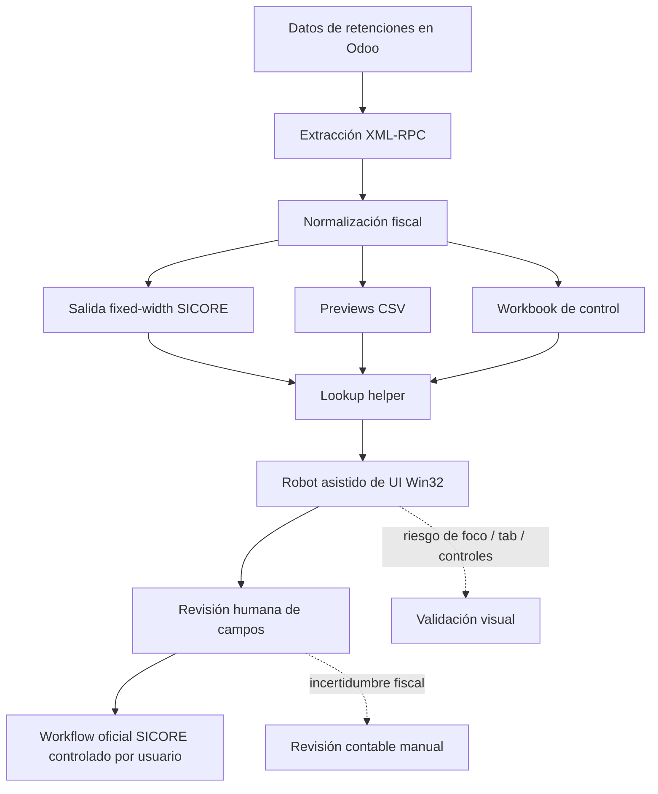

English version: [README.md](README.md)

# Legacy Tax Workflow Automation with Odoo and SICORE

Case type: Legacy system automation / ERP-to-desktop workflow / Tax operations support

## Executive Summary

Este mini case documenta un workflow de automatización asistida para llevar datos de retenciones desde Odoo hacia un proceso fiscal legacy alrededor de SICORE / S.I.Ap / AFIP / ARCA.

El workflow combinó extracción desde Odoo vía XML-RPC, normalización de datos fiscales, generación de salidas estilo fixed-width, previews CSV, workbooks de control, helpers de búsqueda y automatización de UI Win32.

El valor del proyecto no estaba en una interfaz sofisticada. Estaba en reducir fricción en un proceso administrativo tedioso y propenso a error, manteniendo la revisión fiscal bajo control humano.

El sistema debe entenderse como soporte supervisado para un workflow legacy, no como emisión autónoma de certificados fiscales.

## Why This Matters

Los procesos fiscales legacy generan fricción porque muchas veces quedan fuera de APIs modernas y workflows actuales de ERP.

En este tipo de proceso, pequeños errores de carga pueden importar: identificadores fiscales, importes de retención, fechas, referencias de certificados y datos de proveedor requieren manejo cuidadoso. A la vez, las interfaces desktop legacy pueden depender de foco, orden de tabulación, posición del mouse, ventanas modales y particularidades de formato.

La automatización en este contexto solo es valiosa si está controlada. El objetivo es reducir carga manual repetitiva y mejorar trazabilidad sin quitar revisión impositiva/contable humana.

## Business Problem

El problema operativo era preparar información de certificados de retención desde datos de órdenes de pago en Odoo y llevarla a SICORE / S.I.Ap, un sistema fiscal legacy sin API moderna para el workflow interactivo.

El proceso manual implicaba:

- buscar datos de retenciones en Odoo;
- preparar campos fiscales;
- reingresar o transferir datos a SICORE;
- navegar una UI legacy difícil;
- evitar errores de tipeo en campos numéricos y fiscales sensibles;
- mantener suficiente evidencia de control para revisión.

El objetivo era hacer el workflow más repetible y menos tedioso, preservando control humano sobre los resultados fiscales.

## Context

Odoo actuaba como fuente ERP para grupos de pago, pagos, registros de retenciones, facturas, partners y contexto de regímenes fiscales.

SICORE / S.I.Ap actuaba como entorno fiscal desktop legacy. El workflow era sensible porque estaba relacionado con certificados de retención y soporte de reporting fiscal.

Todo material público está anonimizado. Proveedores reales, CUITs, importes de retención, fechas, identificadores de Odoo, certificados, capturas, exports, logs y datos de empresa no están incluidos.

## My Role

Mi rol fue estructurar el workflow ERP-to-legacy y diseñar un camino práctico de automatización alrededor de una interfaz desktop difícil.

Trabajé en:

- mapear el flujo de datos desde Odoo hacia SICORE;
- identificar campos necesarios para preparar certificados de retención;
- apoyar la extracción desde Odoo;
- diseñar salidas de control para revisión;
- diseñar y validar pasos de automatización de UI;
- manejar foco de ventana, teclado, mouse y controles legacy;
- mantener el proceso supervisado, no autónomo.

## Approach

El enfoque fue incremental:

1. Extraer datos relacionados con retenciones desde Odoo.
2. Normalizar información fiscal relevante.
3. Generar salida estilo fixed-width orientada a SICORE.
4. Generar previews CSV y un workbook de control.
5. Construir un helper de lookup para registros de retención seleccionados.
6. Inspeccionar la UI legacy e identificar comportamiento de controles.
7. Automatizar pasos repetitivos con asistencia Win32 / teclado / mouse.
8. Mantener revisión humana para selección de período, verificación de campos y control del circuito oficial.

## Before / After

| Before | After |
|---|---|
| Búsqueda manual de datos de retención en Odoo | Extracción estructurada desde Odoo |
| Reingreso manual de campos fiscales | Transferencia asistida de campos preparados |
| Baja previsualización antes de usar la UI legacy | Previews CSV y workbook de control |
| Navegación tediosa por SICORE / S.I.Ap | Workflow asistido paso a paso en UI |
| Mayor riesgo de errores de tipeo | Preparación repetible de campos y puntos de revisión |
| Revisión dependiente de archivos dispersos y memoria | Outputs trazables y checkpoints de validación humana |

## Solution

La solución conectó datos ERP con un workflow desktop legacy:

```text
Datos de Odoo
        |
        v
Extracción XML-RPC
        |
        v
Normalización de retenciones
        |
        v
Salida fixed-width SICORE
        |
        v
Previews CSV
        |
        v
Workbook de control
        |
        v
Lookup helper
        |
        v
Robot asistido de UI Win32
        |
        v
Revisión humana
```

El workflow crea artefactos de control y asiste la interacción con la UI legacy. No elimina la revisión humana del proceso fiscal.

## Architecture

La arquitectura tiene cuatro capas:

- Extracción ERP: lee registros relacionados con retenciones desde Odoo.
- Preparación de datos: normaliza campos fiscales y genera salidas orientadas a SICORE.
- Capa de control: crea previews, resúmenes en workbook y soporte de lookup.
- Asistencia de UI legacy: ayuda a navegar y completar campos seleccionados de SICORE / S.I.Ap bajo supervisión humana.

## Architecture Diagram



## Demo Artifacts

La carpeta `demo/` contiene ejemplos sintéticos:

- `sample_withholding_record.json`: registro ficticio de retención después de extracción ERP.
- `sample_fixed_width_preview.txt`: preview ficticio estilo fixed-width.
- `sample_control_workbook_summary.json`: resumen ficticio de workbook de control.
- `sample_ui_automation_step.json`: paso ficticio de automatización de UI Win32.
- `sample_validation_summary.json`: resumen ficticio de validación.

Estos archivos no están basados en proveedores reales, tax IDs reales, certificados reales, registros reales de Odoo, exports reales de SICORE, logs, capturas ni datos reales de empresa.

## Tools & Methods

- Python para extracción, transformación y soporte de workflow local.
- Odoo XML-RPC para leer registros relacionados con retenciones.
- Generación de archivos fixed-width para compatibilidad con sistemas legacy.
- Outputs preview en CSV.
- Excel / workbook de control para revisión.
- Helper de lookup para filas seleccionadas de retenciones.
- Conceptos de automatización de UI Win32 / pywin32.
- Manejo de teclado, mouse, foco, tabulación y controles de ventana.
- Diseño de workflow supervisado por humanos.

## Legacy UI Challenge

Este fue el desafío técnico central.

SICORE / S.I.Ap es un entorno desktop legacy, no una herramienta moderna API-first. La interacción puede depender de:

- controles antiguos estilo Win32 / VB;
- foco de ventana activa;
- secuencias exactas de tabulación y teclado;
- clicks de mouse en el estado correcto;
- ventanas modales y comportamiento oculto de controles;
- formato de campos numéricos;
- dificultad para copiar/pegar;
- validación visual después de cada paso crítico.

Eso convierte la automatización en algo más cercano a RPA controlado que a una integración backend normal. El robot necesitaba acompañar a una persona durante el proceso, no operar como motor fiscal invisible.

## Validation & Controls

El workflow usa varios puntos de control:

- previews CSV antes de depender de la UI legacy;
- resúmenes en workbook de control;
- helper de lookup para registros seleccionados de retención;
- revisión humana del estado de la UI legacy;
- validación visual de campos completados;
- separación explícita entre preparación de datos y manejo oficial de certificados;
- sin ejecución fiscal autónoma;
- sin emisión de certificados sin control humano.

## What This Does Not Do

Este workflow no:

- emite certificados oficiales de retención end-to-end automáticamente;
- imprime certificados automáticamente a PDF;
- reemplaza revisión impositiva/contable;
- opera sin supervisión humana;
- publica datos fiscales reales;
- afirma KPIs productivos;
- afirma automatización completa de cumplimiento fiscal;
- afirma ahorros, tasa de éxito o reducción de errores cuantificados;
- publica proveedores reales, CUITs, importes, IDs de Odoo, exports de SICORE, capturas, logs o datos reales de empresa.

Debe presentarse como automatización asistida de workflow fiscal legacy, no como sistema fiscal totalmente autónomo.

## Impact

El impacto es cualitativo:

- reduce carga manual repetitiva;
- mejora trazabilidad desde datos ERP hasta preparación en sistema legacy;
- crea un workflow más repetible;
- soporta transferencia de datos más segura desde Odoo hacia un sistema fiscal legacy;
- reduce fricción operativa en un proceso tedioso;
- mantiene revisión impositiva/contable humana.

No se afirman ahorros de tiempo, ahorros de costo, volumen productivo, tasa de éxito, resultado de compliance ni reducción de errores cuantificada.

## Recruiter Signal

Este caso demuestra:

- automatización de sistemas legacy;
- integración ERP;
- pensamiento estilo RPA;
- mapeo de procesos;
- entendimiento de workflows administrativos/fiscales;
- automatización pragmática en sistemas no ideales;
- diseño con conciencia de riesgo;
- capacidad de automatizar procesos poco glamorosos pero críticos para el negocio;
- comunicación clara de límites de alcance en workflows sensibles.

## What I Learned

- Parte de la automatización más valiosa ocurre en sistemas legacy poco atractivos.
- La automatización de UI necesita más cautela operativa que una integración por API.
- Los outputs de control son tan importantes como el robot.
- Los workflows fiscales deben mantener humanos en el loop.
- Un buen diseño de automatización hace visible la incertidumbre en vez de esconderla.

## Next Steps

- Revisar si este mini case debe seguir como cuarto caso público del portfolio.
- Ejecutar una búsqueda sensible final antes de cualquier copia pública.
- Recrear cualquier ejemplo visual solo con datos sintéticos.
- Evitar publicar scripts crudos salvo que estén completamente sanitizados.
- Considerar un diagrama público simple en vez de screenshots.
