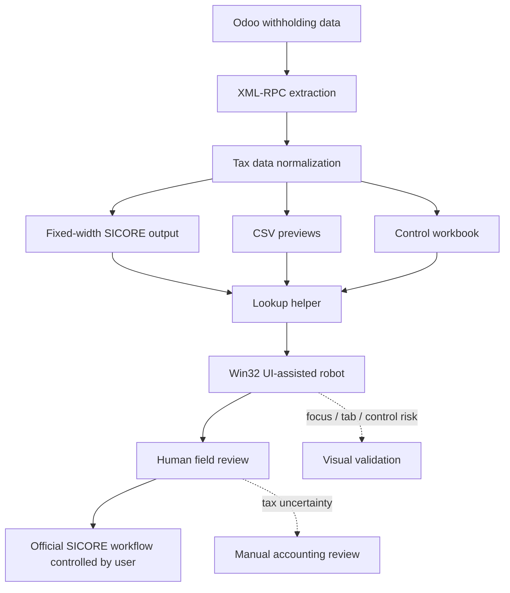

# Legacy Tax Workflow Automation with Odoo and SICORE

Case type: Legacy system automation / ERP-to-desktop workflow / Tax operations support

## Executive Summary

This mini case documents an assisted automation workflow for moving withholding data from Odoo into a legacy tax process around SICORE / S.I.Ap / AFIP / ARCA.

The workflow combined Odoo XML-RPC extraction, tax data normalization, fixed-width-style output generation, CSV previews, control workbooks, lookup helpers, and Win32 UI automation.

The value of the project was not a glamorous interface. It was reducing friction in a tedious, error-prone administrative process while keeping tax review under human control.

The system should be understood as supervised legacy workflow support, not autonomous tax certificate issuance.

## Why This Matters

Legacy fiscal processes create friction because they often sit outside modern APIs and current ERP workflows.

In this type of process, small data-entry mistakes can matter: tax identifiers, withholding amounts, dates, certificate references, and supplier data need careful handling. At the same time, legacy desktop interfaces can depend on focus, tab order, mouse position, modal windows, and formatting quirks.

Automation in this context is valuable only if it is controlled. The goal is to reduce repetitive manual entry and improve traceability without removing human tax/accounting review.

## Business Problem

The operational problem was preparing withholding certificate information from Odoo payment-order data and moving it into SICORE / S.I.Ap, a legacy fiscal system with no modern API for the interactive workflow.

The manual process involved:

- finding withholding data in Odoo;
- preparing fiscal fields;
- re-entering or transferring data into SICORE;
- navigating a difficult legacy UI;
- avoiding typing mistakes in sensitive numeric and tax fields;
- keeping enough control evidence for review.

The goal was to make the workflow more repeatable and less tedious while preserving human control over fiscal outcomes.

## Context

Odoo acted as the ERP source for payment groups, payments, withholding records, invoices, partners, and tax-regime context.

SICORE / S.I.Ap acted as the legacy desktop tax environment. The workflow was sensitive because it related to withholding certificates and tax reporting support.

All public-facing material in this draft is anonymized. Real suppliers, CUITs, withholding amounts, dates, Odoo identifiers, certificates, screenshots, exports, logs, and company data are not included.

## My Role

My role was to structure the ERP-to-legacy workflow and design a practical automation path around a difficult desktop interface.

I worked on:

- mapping the data flow from Odoo to SICORE;
- identifying fields needed for withholding certificate preparation;
- supporting extraction from Odoo;
- designing control outputs for review;
- designing and validating UI automation steps;
- handling window focus, keyboard, mouse, and legacy controls;
- keeping the process supervised instead of autonomous.

## Approach

The approach was incremental:

1. Extract withholding-related data from Odoo.
2. Normalize tax-relevant information.
3. Generate fixed-width-style output for SICORE-related use.
4. Generate CSV previews and a control workbook.
5. Build a lookup helper for selected exported withholding records.
6. Inspect the legacy UI and identify control behavior.
7. Automate repetitive UI steps with Win32 / keyboard / mouse assistance.
8. Keep human review in place for period selection, field verification, and official workflow control.

## Before / After

| Before | After |
|---|---|
| Manual lookup of withholding data in Odoo | Structured extraction from Odoo |
| Re-entering fiscal fields by hand | Assisted transfer of prepared withholding fields |
| Weak preview before using the legacy UI | CSV previews and control workbook |
| Tedious navigation through SICORE / S.I.Ap | Step-by-step assisted UI workflow |
| Higher risk of typing mistakes | Repeatable field preparation and review points |
| Review depends on scattered files and memory | Traceable outputs and human validation checkpoints |

## Solution

The solution connected ERP data with a legacy desktop workflow:

```text
Odoo data
        |
        v
XML-RPC extraction
        |
        v
Withholding normalization
        |
        v
Fixed-width SICORE output
        |
        v
CSV previews
        |
        v
Control workbook
        |
        v
Lookup helper
        |
        v
Win32 UI-assisted robot
        |
        v
Human review
```

The workflow creates control artifacts and assists the legacy UI interaction. It does not remove human review from the fiscal process.

## Architecture

The architecture has four layers:

- ERP extraction: reads withholding-related records from Odoo.
- Data preparation: normalizes fiscal fields and generates SICORE-oriented outputs.
- Control layer: creates previews, workbook summaries, and lookup support.
- Legacy UI assistance: helps navigate and populate selected SICORE / S.I.Ap fields under human supervision.

## Architecture Diagram



## Demo Artifacts

The `demo/` folder contains synthetic examples:

- `sample_withholding_record.json`: fictitious withholding record after ERP extraction.
- `sample_fixed_width_preview.txt`: fictitious fixed-width-style preview.
- `sample_control_workbook_summary.json`: fictitious control workbook summary.
- `sample_ui_automation_step.json`: fictitious Win32 UI automation step.
- `sample_validation_summary.json`: fictitious validation summary.

These files are not based on real suppliers, tax IDs, withholding certificates, Odoo records, SICORE exports, logs, screenshots, or company data.

## Tools & Methods

- Python for extraction, transformation, and local workflow support.
- Odoo XML-RPC for reading withholding-related records.
- Fixed-width file generation for legacy-system compatibility.
- CSV preview outputs.
- Excel / control workbook style review outputs.
- Lookup helper for selected withholding rows.
- Win32 / pywin32-style UI automation concepts.
- Keyboard, mouse, focus, tab-order, and window-control handling.
- Human-supervised workflow design.

## Legacy UI Challenge

This was the core technical challenge.

SICORE / S.I.Ap is a legacy desktop environment, not a modern API-first tool. The interaction can depend on:

- old Win32 / VB-style controls;
- active window focus;
- exact tab and keyboard sequences;
- mouse clicks in the right state;
- modal windows and hidden control behavior;
- numeric field formatting;
- difficult copy/paste behavior;
- visual validation after each critical step.

That makes the automation closer to controlled RPA than normal backend integration. The robot needed to support a person through the process, not operate as an invisible fiscal engine.

## Validation & Controls

The workflow uses multiple control points:

- CSV previews before relying on the legacy UI;
- control workbook summaries;
- lookup helper for selected withholding records;
- human review of the legacy UI state;
- visual validation of populated fields;
- explicit separation between data preparation and official certificate handling;
- no autonomous fiscal execution;
- no certificate issuance without human control.

## What This Does Not Do

This workflow does not:

- issue official withholding certificates end-to-end automatically;
- automatically print certificates to PDF;
- replace tax/accounting review;
- operate without human supervision;
- publish real tax data;
- claim production KPIs;
- claim full fiscal compliance automation;
- claim quantified savings, success rate, or error reduction;
- publish real suppliers, CUITs, amounts, Odoo IDs, SICORE exports, screenshots, logs, or company data.

It should be presented as assisted legacy tax workflow automation, not as a fully autonomous fiscal system.

## Impact

The impact is qualitative:

- reduces repetitive manual entry;
- improves traceability from ERP data to legacy-system preparation;
- creates a more repeatable workflow;
- supports safer data transfer from Odoo to a legacy fiscal system;
- reduces operational friction in a tedious process;
- keeps human tax/accounting review in place.

No time savings, cost savings, production volume, success rate, compliance outcome, or quantified error reduction is claimed.

## Recruiter Signal

This case demonstrates:

- legacy system automation;
- ERP integration;
- RPA-style thinking;
- process mapping;
- tax/admin workflow understanding;
- pragmatic automation in non-ideal systems;
- risk-aware design;
- ability to automate ugly but business-critical processes;
- communication of scope limits in sensitive workflows.

## What I Learned

- Some of the highest-value automation work happens in unglamorous legacy systems.
- UI automation needs more operational caution than API integration.
- Control outputs are just as important as the robot itself.
- Fiscal workflows should keep humans in the loop.
- A strong automation design makes uncertainty visible instead of hiding it.

## Next Steps

- Review whether this mini case should become the fourth public portfolio case.
- Run a final sensitive scan before any public copy.
- Recreate any visual examples with synthetic data only.
- Avoid publishing raw scripts unless they are fully sanitized.
- Consider adding a simple public diagram instead of screenshots.
