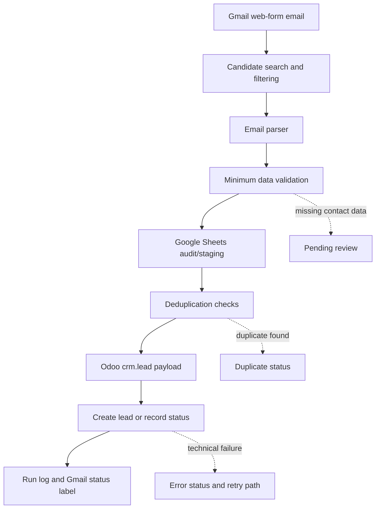

# CRM Lead Intake Automation with Gmail, Sheets and Odoo

Case type: CRM automation / Sales operations / Lead intake workflow

## Executive Summary

This case documents a controlled lead-intake workflow that turns web-form emails in Gmail into traceable Odoo CRM leads.

The workflow uses Google Apps Script to search candidate emails, parse lead fields, validate minimum contact data, stage processing results in Google Sheets, deduplicate against prior audit records and Odoo CRM, and create `crm.lead` records when the lead is eligible.

The goal was not to build a fully autonomous sales system. The goal was to reduce manual CRM entry risk, avoid duplicate opportunities, preserve processing traceability, and create a safer operational base for Sales Operations automation.

## Why This Matters

Lead intake is one of the first operational control points in a commercial process. If a lead is lost, duplicated, incomplete, or loaded with poor data quality, the downstream sales workflow becomes harder to manage.

For a small or growing operation, the problem is rarely only technical. It is operational: where did the lead come from, was it already processed, was it duplicated in CRM, what happened during the run, and who needs to review exceptions?

This case matters because it treats CRM automation as a controlled intake process, not just as a script that copies text from email into an ERP.

## Business Problem

The business problem was a common Sales Operations issue: leads arrived through web-form emails and needed to be captured in Odoo CRM without being lost, duplicated, or loaded with incomplete information.

The main risks were:

- manual copy/paste from email to CRM;
- missing or incomplete contact data;
- duplicate leads in Odoo;
- weak traceability of which messages were processed;
- unclear status for failed or review-needed leads;
- limited visibility into what each automated run did.

The objective was to build a controlled lead-intake workflow that could process Gmail leads, stage results in Sheets, deduplicate, and create CRM records with auditability.

## Context

The implementation belongs to CRM Operations and Sales Operations automation.

The audited public scope is intentionally narrow: Gmail/web-form email intake, Google Sheets audit/staging, and Odoo CRM lead creation.

Social-media leads via a separate Google Sheets workflow were identified as a related project, but they are not included in the claims of this case study. WhatsApp and direct Instagram DM processing are out of scope for this MVP.

All public-facing content is sanitized. Real leads, emails, phone numbers, prospect names, messages, Sheet IDs, Gmail labels, Odoo URLs, Odoo IDs, logs, credentials, and screenshots are not included.

## My Role

My role was to structure the workflow from operational problem to working automation.

I worked on:

- defining a safe lead-intake process;
- separating Gmail search, parsing, validation, deduplication, CRM write, and audit logging;
- using Google Sheets as a control layer;
- validating minimum lead data before CRM creation;
- avoiding duplicate CRM records where possible;
- keeping `DRY_RUN`, logs, labels, and health checks as operational controls;
- documenting the evidence boundary so the public case does not overclaim channels or impact.

## Approach

The approach was control-first:

1. Search candidate Gmail messages with a controlled query.
2. Exclude replies and forwards that should not create new leads.
3. Parse structured fields from the email body.
4. Validate minimum contact requirements.
5. Check whether the message was already audited.
6. Deduplicate against Odoo CRM.
7. Create the Odoo `crm.lead` only when the lead is eligible.
8. Write every outcome to Google Sheets audit/run logs.
9. Apply Gmail status labels as visual support.
10. Use health checks and trigger controls to operate the workflow safely.

## Before / After

| Before | After |
|---|---|
| Web-form leads handled manually from Gmail | Structured Gmail lead-intake workflow |
| CRM creation depends on copy/paste | Parsed lead fields mapped into a CRM payload |
| Duplicate checks depend on manual memory | Audit-log and Odoo deduplication checks |
| Failed or incomplete leads are hard to trace | Reviewable statuses in Google Sheets |
| Run visibility depends on manual inspection | Run logs and health checks |
| Automation risk is hard to limit | `DRY_RUN`, batch limits, manual retry, and trigger controls |

## Solution

The solution is a Google Apps Script workflow connected to Gmail, Google Sheets, and Odoo CRM.

It searches for candidate lead emails, parses commercial contact fields, validates the minimum data needed for CRM creation, stages processing outcomes in a Google Sheet, checks for duplicates, and creates Odoo `crm.lead` records through JSON-RPC when appropriate.

The workflow also records dry-run outcomes, duplicate detections, review-needed rows, errors, and run summaries. Gmail labels provide a secondary visual cue, while Google Sheets remains the operational audit layer.

## Architecture

```text
Gmail web-form email
        |
        v
Candidate search and filtering
        |
        v
Email parser
        |
        v
Minimum data validation
        |
        v
Google Sheets audit/staging
        |
        v
Deduplication against audit log and Odoo CRM
        |
        v
Odoo crm.lead creation or controlled status
        |
        v
Run log, Gmail label, and review trail
```

## Architecture Diagram



## Demo Artifacts

The `demo/` folder contains synthetic examples:

- `sample_lead_email.json`: fictitious Gmail web-form lead email.
- `sample_parsed_lead.json`: fictitious parsed lead fields.
- `sample_sheet_audit_record.json`: fictitious Google Sheets audit record.
- `sample_deduplication_result.json`: fictitious deduplication decision.
- `sample_odoo_crm_lead_payload.json`: fictitious Odoo CRM lead payload.
- `sample_processing_log.json`: fictitious run-level processing log.

These files are synthetic and are not based on real leads, emails, phone numbers, customers, prospects, Odoo records, Sheets, logs, or company data.

## Tools & Methods

- Google Apps Script as the automation runtime.
- GmailApp for searching and labeling candidate messages.
- Google Sheets as audit log, staging layer, and run log.
- Odoo JSON-RPC for CRM integration.
- `crm.lead` as the target Odoo CRM model.
- Parser logic for structured email fields.
- Deduplication by message audit, email, and name + phone.
- `DRY_RUN` for safe testing before CRM creation.
- Time-driven triggers for recurring execution.
- Health checks and manual debug functions.

## Validation & Controls

The workflow includes:

- controlled Gmail query;
- exclusion of replies and forwards;
- minimum lead-data validation;
- audit-log idempotency by message ID;
- deduplication against Odoo CRM before creation;
- `DRY_RUN` mode;
- explicit statuses for created, duplicate, dry-run, pending review, and error;
- run-level logging;
- Gmail status labels as visual support;
- manual retry path for error or review-needed rows;
- trigger creation/deletion controls;
- health check for properties, triggers, recent runs, and errors.

## What This Does Not Do

This case does not claim that the workflow:

- processes WhatsApp messages;
- processes direct Instagram DMs;
- provides full omnichannel lead intake;
- includes social-media Sheets intake inside this specific public case;
- guarantees duplicate elimination;
- improves conversion rate or revenue;
- processes a claimed production volume;
- assigns sales owners automatically;
- replaces commercial review;
- operates as a fully autonomous sales system;
- publishes real leads, emails, phone numbers, messages, Sheet IDs, Gmail labels, Odoo URLs, Odoo IDs, logs, or credentials.

## Impact

The impact is qualitative:

- reduces manual CRM-entry friction;
- improves traceability from Gmail message to CRM processing outcome;
- supports cleaner lead intake through minimum validation;
- reduces duplicate-creation risk through audit and CRM checks;
- makes failed or review-needed leads more visible;
- creates a safer foundation for Sales Operations automation.

No conversion improvement, revenue impact, lead volume, time savings, success rate, or error-reduction metric is claimed.

## Recruiter Signal

This case demonstrates:

- CRM and Sales Operations understanding;
- ability to convert a messy intake process into a controlled workflow;
- practical integration across Gmail, Google Sheets, and Odoo CRM;
- automation design with deduplication, logging, and safe-run controls;
- operational judgment around privacy and data quality;
- ability to build low-cost internal tools using existing business systems;
- clear boundary-setting between implemented scope and future channels.

## What I Learned

- CRM automation needs traceability as much as field mapping.
- Google Sheets can be a practical control layer when used intentionally.
- Deduplication should combine source-level idempotency and CRM-level checks.
- `DRY_RUN` and run logs are essential when automation writes to business systems.
- A narrow, well-controlled workflow is stronger than an overclaimed omnichannel story.

## Next Steps

- Run a final sensitive scan before public copy.
- Decide whether the separate RRSS/Meta Sheets workflow should become a second CRM case or a future extension.
- Add a public-safe diagram or mock screenshot using only synthetic data.
- Add public metrics only if measured and safely anonymized.
- Keep WhatsApp and direct Instagram DM processing clearly marked as future scope unless implemented and audited.
