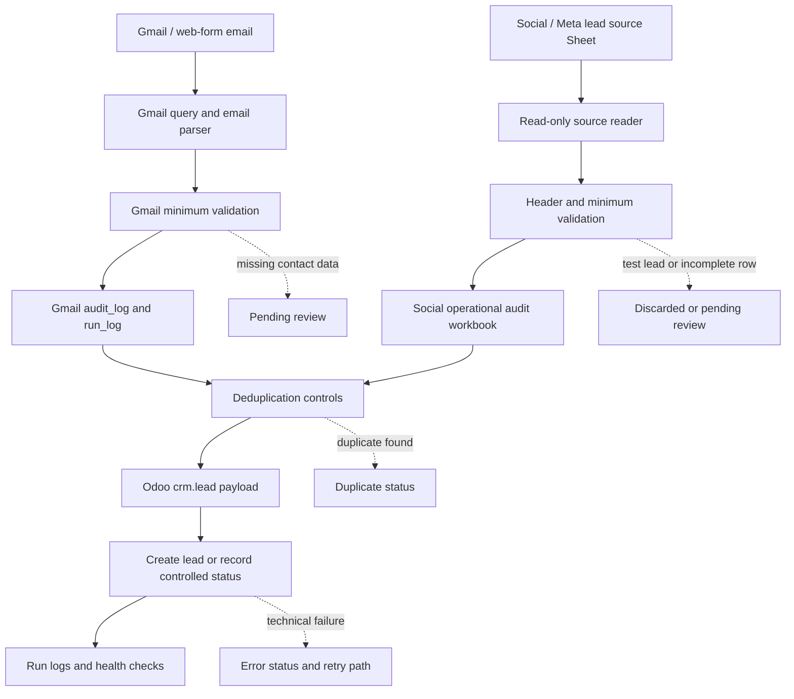

# CRM Lead Intake Automation with Gmail, Social Lead Sheets and Odoo

Case type: CRM automation / Sales operations / Multi-source lead intake workflow

## Executive Summary

This case documents a controlled CRM lead-intake workflow that connects two related lead sources with Odoo CRM:

- Gmail/web-form emails.
- Social/Meta leads already available in Google Sheets.

The workflow uses Google Apps Script, Google Sheets audit/staging layers, deduplication, `DRY_RUN`, run logs, health checks, triggers, and Odoo JSON-RPC to prepare and create `crm.lead` records when each lead is eligible.

The goal was not to claim complete channel coverage. The goal was to reduce manual CRM-entry risk, preserve traceability across lead sources, make duplicates and exceptions visible, and create a safer operating base for Sales Operations automation.

## Why This Matters

Lead intake is one of the first control points in a commercial operation. If leads arrive through different sources and are handled manually, they can be lost, duplicated, delayed, or loaded into CRM with weak data quality.

The business problem is not just "copy lead data into Odoo." The real problem is operational control:

- Which source did the lead come from?
- Was it already processed?
- Does it have enough data to create a CRM record?
- Is it a duplicate?
- What happened during the run?
- Which rows or messages need human review?

This case matters because it treats lead intake as a traceable Sales Operations workflow, not as blind automation.

## Business Problem

The operating need was to automate lead intake into Odoo CRM from digital sources while keeping control over data quality and duplicates.

The two supported flows had different input shapes:

- Gmail/web-form leads arrived as semi-structured emails.
- Social/Meta leads arrived in a Google Sheet source already populated upstream.

Both flows needed to reduce manual CRM entry, avoid duplicate lead creation, preserve run history, and make errors or review-needed items visible.

The objective was to create a controlled intake pattern that could support multiple sources without claiming every possible channel.

## Context

This case belongs to CRM Operations and Sales Operations automation.

Implemented and evidenced scope:

- Gmail/web-form email intake.
- Social/Meta leads via an already populated Google Sheet.
- Google Sheets audit/staging layers.
- Odoo CRM as the destination system.
- Deduplication, `DRY_RUN`, run logs, health checks, triggers, and exception states.

Out of scope:

- WhatsApp direct processing.
- Direct Instagram DM processing.
- Direct Meta API ingestion as a public claim.
- Complete coverage of every possible lead channel.
- Conversion, revenue, production volume, or KPI claims.
- Autonomous sales follow-up or salesperson assignment.

All public-facing content must remain sanitized. Real leads, emails, phone numbers, prospect names, campaign names, messages, Sheet IDs, Gmail labels, Odoo URLs, Odoo IDs, logs, credentials, screenshots, and source workbooks are not included.

## Evidence Boundary

This case combines two implementation evidence groups.

### Gmail/web evidence

Evidence supports:

- Gmail query and message filtering.
- Email body parsing.
- Minimum lead-data validation.
- `audit_log` and `run_log` in Google Sheets.
- Idempotency by message ID.
- Odoo duplicate checks by email and by name + phone.
- `crm.lead` creation through JSON-RPC.
- Gmail labels as visual support.
- `DRY_RUN`, manual execution, time-driven trigger, debug tools, and health check.

### Social/Meta Sheets evidence

Evidence supports:

- Separate Apps Script flow.
- Read-only source Google Sheet containing social/Meta leads.
- Operational audit workbook.
- `rrss_odoo_audit_log` and `rrss_run_log`.
- Source header validation and live-source validation.
- Test-lead exclusion.
- Minimum data validation.
- Deduplication by external lead identifier and Odoo email/phone checks.
- `crm.lead` creation through JSON-RPC.
- `DRY_RUN`, max rows per run, time-driven trigger, Odoo validations, and health check.

### Future or out-of-scope channels

WhatsApp, direct Instagram DMs, direct Meta API ingestion, scoring, salesperson assignment, and conversion analytics are not claimed in this public case.

### Synthetic demo

The demo files are synthetic. They illustrate workflow design and are not evidence of production volume, accuracy, conversion, revenue, or operational performance.

## My Role

My role was to structure the lead-intake problem as a controlled operating workflow.

I worked on:

- defining how each source should enter the process;
- separating source read, parsing/mapping, validation, deduplication, CRM write, and audit logging;
- using Google Sheets as a control layer instead of a passive spreadsheet;
- keeping `DRY_RUN`, run logs, trigger controls, and health checks as operational safeguards;
- preserving human review for exceptions and incomplete data;
- defining the publication boundary so the case reflects the real project without overclaiming channels or impact.

## Approach

The approach was to build two source-specific intake flows that share the same operating principles.

For Gmail/web-form leads:

1. Search candidate Gmail messages with a controlled query.
2. Exclude replies and forwards.
3. Parse structured fields from the email body.
4. Validate minimum contact data.
5. Check whether the message was already audited.
6. Deduplicate against Odoo CRM.
7. Create the Odoo `crm.lead` only when eligible.
8. Write outcomes to audit/run logs and apply status labels.

For social/Meta leads via Sheets:

1. Read rows from an already populated source Google Sheet.
2. Keep the source Sheet read-only.
3. Validate source headers and live-source configuration.
4. Exclude test leads.
5. Validate minimum contact data.
6. Check audit history by external lead identifier and source row.
7. Deduplicate against Odoo CRM.
8. Create the Odoo `crm.lead` only when eligible.
9. Write outcomes to an operational audit workbook and run log.

## Before / After

| Before | After |
|---|---|
| Leads handled manually from email and sheets | Controlled multi-source lead intake workflow |
| Source-specific context can get lost | Source-specific audit records and run logs |
| CRM creation depends on manual copy/paste | Parsed/mapped lead fields prepared for Odoo CRM |
| Duplicate checks depend on memory | Source-level and Odoo-level deduplication checks |
| Failed or incomplete leads are hard to track | Review statuses and error logs |
| Social lead source can be accidentally modified | Read-only source handling with separate operational workbook |
| Automation risk is hard to limit | `DRY_RUN`, batch limits, trigger controls, and health checks |

## Solution

The solution is a controlled lead-intake pattern built on Google Apps Script, Google Sheets, and Odoo CRM.

The Gmail/web flow turns candidate web-form emails into parsed lead data, stages the result in a Google Sheets audit log, checks duplicates, and creates Odoo `crm.lead` records when the lead is eligible.

The social/Meta Sheets flow reads rows from a source Sheet that already contains social lead data, validates the source schema, maps fields into CRM-ready values, records outcomes in an operational audit workbook, checks duplicates, and creates Odoo `crm.lead` records when the row is eligible.

Both flows prioritize traceability and control over blind automation.

## Architecture

```text
Gmail/web-form email                 Social/Meta lead source Sheet
        |                                      |
        v                                      v
Gmail query + parser                 Read-only source reader
        |                                      |
        v                                      v
Minimum validation                   Header + minimum validation
        |                                      |
        v                                      v
Google Sheets audit/run log          Operational audit workbook
        |                                      |
        +---------------+----------------------+
                        |
                        v
             Deduplication controls
                        |
                        v
              Odoo crm.lead payload
                        |
                        v
        Create lead / dry-run / duplicate / review / error
                        |
                        v
              Run logs + health checks
```

## Architecture Diagram



## Demo Artifacts

The `demo/` folder contains synthetic examples for both lead-intake flows.

Existing Gmail/web-form demo artifacts:

- `sample_lead_email.json`: synthetic Gmail web-form lead email.
- `sample_parsed_lead.json`: synthetic parsed lead fields.
- `sample_sheet_audit_record.json`: synthetic Google Sheets audit/staging record.
- `sample_deduplication_result.json`: synthetic deduplication decision.
- `sample_odoo_crm_lead_payload.json`: synthetic Odoo CRM lead payload.
- `sample_processing_log.json`: synthetic run-level processing log.

New social/Meta Sheets demo artifacts:

- `sample_social_lead_sheet_row.json`: synthetic source Sheet row for a social/Meta lead.
- `sample_social_lead_mapping.json`: synthetic mapping from source row to CRM-ready fields.
- `sample_social_deduplication_result.json`: synthetic deduplication decision.
- `sample_social_audit_record.json`: synthetic operational audit record.
- `sample_social_run_log.json`: synthetic social-flow run log.
- `sample_multi_source_case_summary.json`: synthetic summary showing how the two flows fit the same lead-intake pattern.

These files are not based on real leads, emails, phone numbers, customers, prospects, social-media campaigns, Meta records, Odoo records, Google Sheets, logs, screenshots, or company data.

## Tools & Methods

- Google Apps Script as the automation runtime.
- GmailApp for Gmail/web-form message search and labeling.
- Google Sheets as audit log, staging layer, source layer, and run log.
- Read-only source handling for social lead Sheets.
- Header validation for source Sheets.
- Odoo JSON-RPC for CRM integration.
- `crm.lead` as the target Odoo CRM model.
- Parser logic for email fields.
- Mapper logic for social lead Sheet rows.
- Deduplication by message ID, external lead identifier, email, and phone-based checks.
- `DRY_RUN` for safe testing before CRM creation.
- Batch limits for controlled runs.
- Time-driven triggers for recurring execution.
- Health checks and debug functions.

## Validation & Controls

Gmail/web controls:

- controlled Gmail query;
- reply/forward exclusion;
- message ID idempotency;
- minimum lead-data validation;
- Google Sheets `audit_log`;
- Google Sheets `run_log`;
- Odoo duplicate checks by email and name + phone;
- status labels as visual support;
- `DRY_RUN`;
- manual retry path;
- trigger controls and health check.

Social/Meta Sheets controls:

- read-only source Sheet handling;
- source header validation;
- live-source validation;
- external lead identifier checks;
- source row tracking;
- test-lead exclusion;
- minimum lead-data validation;
- operational audit workbook;
- `rrss_odoo_audit_log`;
- `rrss_run_log`;
- Odoo duplicate checks by email and phone variants;
- `DRY_RUN`;
- max rows per run;
- trigger controls and health check.

Shared controls:

- create CRM leads only when required checks pass;
- preserve review-needed and error states;
- keep run-level traceability;
- avoid publishing raw operational data.

## What This Does Not Do

This case does not claim that the workflow:

- processes WhatsApp messages;
- processes direct Instagram DMs;
- provides complete automation across every possible lead channel;
- ingests leads directly from the Meta API as a public claim;
- guarantees duplicate elimination;
- improves conversion rate;
- produces revenue impact;
- processes a claimed production volume;
- assigns sales owners automatically;
- runs autonomous sales follow-up;
- replaces commercial review;
- publishes real leads, emails, phone numbers, campaign data, Sheet IDs, Gmail labels, Odoo URLs, Odoo IDs, logs, screenshots, or credentials.

## Impact

The impact is qualitative:

- reduces manual CRM-entry friction;
- improves traceability across web-form and social lead sources;
- supports cleaner lead intake through minimum validation;
- reduces duplicate-creation risk through source and Odoo checks;
- makes failed, duplicated, discarded, or review-needed leads visible;
- creates a stronger foundation for Sales Operations automation.

No conversion improvement, revenue impact, production volume, time savings, success rate, or error-reduction metric is claimed.

## Recruiter Signal

This case demonstrates:

- CRM and Sales Operations understanding;
- multi-source lead-intake design;
- data-quality thinking around lead creation;
- practical integration across Google Workspace and Odoo CRM;
- Google Apps Script implementation judgment;
- Google Sheets used as a staging/control layer;
- deduplication and auditability;
- operational controls such as `DRY_RUN`, run logs, triggers, and health checks;
- privacy-aware automation in a commercial workflow;
- clear boundary-setting between implemented scope and future channels.

## What I Learned

- Lead intake becomes more valuable when source-specific workflows share common controls.
- Google Sheets can work as a practical audit/staging layer when it is designed intentionally.
- Source-level idempotency and CRM-level deduplication solve different problems.
- A read-only source pattern reduces risk when the incoming lead source is shared or externally populated.
- `DRY_RUN`, run logs, and health checks are part of the product, not secondary utilities.
- A precise scope is stronger than an overclaimed channel-coverage story.

## Next Steps

- Run a final sensitive scan before any public update.
- Publish only synthetic social-flow demo artifacts.
- Add direct Meta API ingestion only if later implemented, audited, and sanitized.
- Keep WhatsApp and direct Instagram DMs as future scope unless implemented and audited.
- Add public metrics only if they are measured and safely anonymized.
