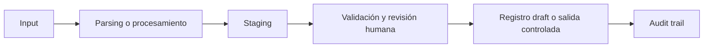

# Título del case study

English version: [case-study-template.md](case-study-template.md)

## Executive Summary

Escribir un resumen breve del problema de negocio, el enfoque de solución y el valor cualitativo del trabajo.

## Business Problem

Describir el problema operativo o de negocio. Mantener el foco en por qué importa.

## Why This Matters

Explicar por qué el workflow es relevante para operaciones, procurement, finanzas, supply chain o control de negocio.

## Context

Dar suficiente contexto para que un lector público entienda la situación, sin exponer detalles privados.

## My Role

Explicar qué hiciste: análisis, diseño de proceso, automatización, validación, documentación, coordinación con stakeholders o soporte de implementación.

## Approach

Describir cómo estructuraste el problema y el workflow.

## Before / After

| Before | After |
|---|---|
| Paso manual o fragmentado | Paso estructurado de workflow |
| Trazabilidad débil | Audit trail más claro |
| Mayor riesgo operativo | Mejores puntos de control |

## Solution

Describir la solución en términos prácticos de negocio.

## Architecture

Explicar el workflow desde inputs hasta outputs.

## Architecture Diagram

## Tools & Methods

Listar herramientas, métodos, sistemas o técnicas usadas.

## Validation & Controls

Explicar controles de duplicados, staging, revisión humana, auditabilidad, manejo de excepciones u otros puntos de control.

## Impact

Usar impacto cualitativo salvo que existan métricas públicas y seguras para publicar.

Ejemplos:

- menor carga de tipeo manual;
- menor riesgo de duplicados;
- mejor trazabilidad;
- intake de proceso más estandarizado;
- puntos de revisión humana más claros.

## Recruiter Signal

Explicar qué demuestra este caso para un recruiter o hiring manager.

## What I Learned

Resumir los aprendizajes profesionales del trabajo.

## Next Steps

Describir cómo podría evolucionar el caso.

## Privacy Note

Este case study público está sanitizado. Los datos demo son sintéticos y no representan datos reales de empresa, clientes, proveedores, facturas, ERP o credenciales.
