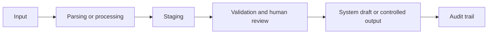

# Case Study Title

## Executive Summary

Write a concise summary of the business problem, the solution approach, and the qualitative value of the work.

## Business Problem

Describe the operational or business issue. Keep the focus on why the problem matters.

## Why This Matters

Explain why the workflow is relevant for operations, procurement, finance, supply chain, or business control.

## Context

Provide enough context for a public reader to understand the situation, without exposing private details.

## My Role

Explain what you did: analysis, process design, automation, validation, documentation, stakeholder alignment, or implementation support.

## Approach

Describe how you structured the problem and the workflow.

## Before / After

| Before | After |
|---|---|
| Manual or fragmented step | Structured workflow step |
| Weak traceability | Clearer audit trail |
| Higher operational risk | Better control points |

## Solution

Describe the solution in practical business terms.

## Architecture

Explain the workflow from inputs to outputs.

## Architecture Diagram

## Tools & Methods

List tools, methods, systems, or techniques used.

## Validation & Controls

Explain duplicate checks, staging, human review, auditability, exception handling, or other control points.

## Impact

Use qualitative impact unless public metrics are available and safe to publish.

Examples:

- reduced manual retyping;
- lower duplicate risk;
- better traceability;
- standardized process intake;
- clearer human review points.

## Recruiter Signal

Explain what this case demonstrates for a recruiter or hiring manager.

## What I Learned

Summarize the professional lessons from the work.

## Next Steps

Describe how the case could evolve.

## Privacy Note

This public case study is sanitized. Demo data is synthetic and does not represent real company, customer, supplier, invoice, ERP, or credential data.
